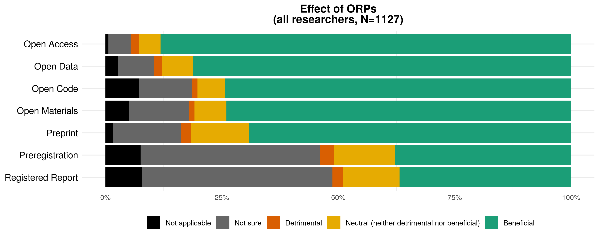
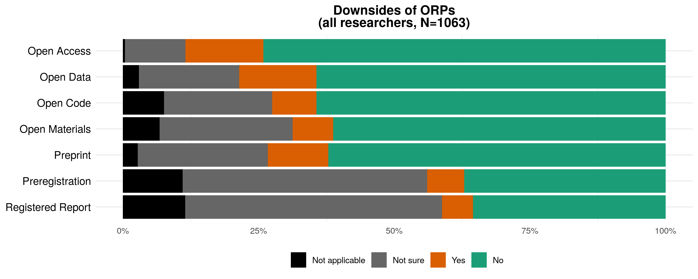
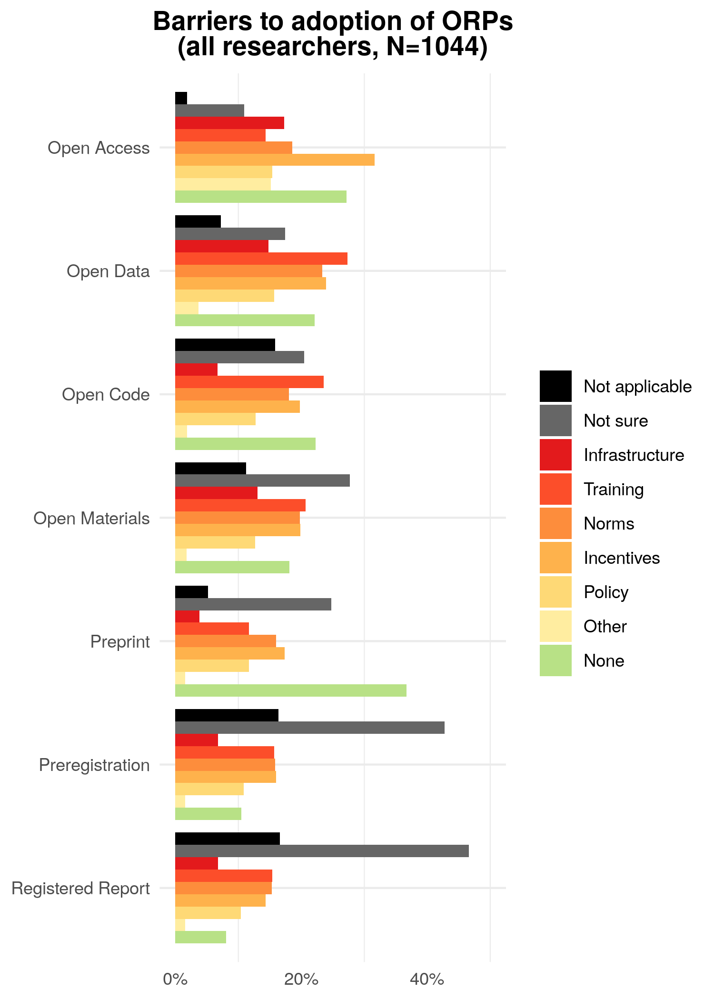
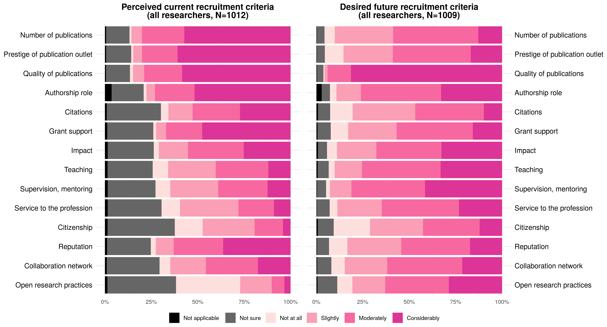
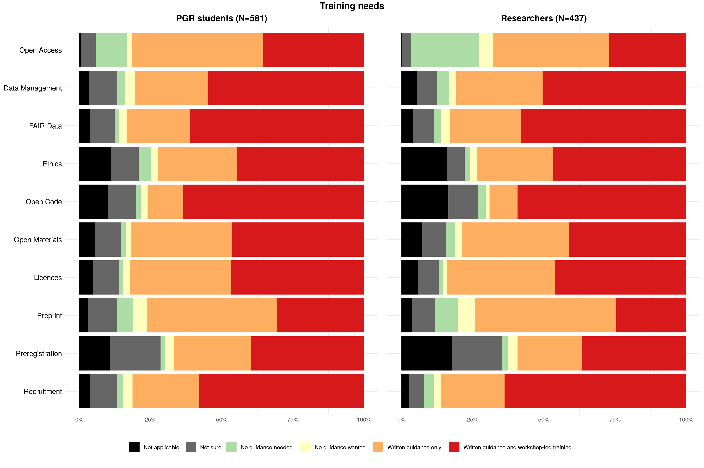
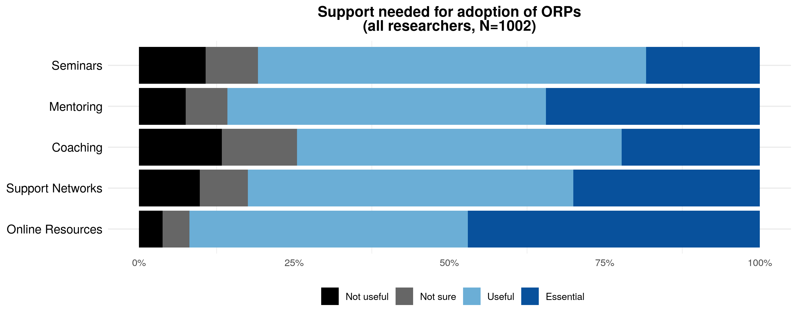

```{=html}
<style>
body {
text-align: justify}
</style>
```
```{=html}
<style type="text/css">
h1.title {
  text-align: center;
}

</style>
```
```{r setup, include=FALSE}
library(flextable)
library(tidyverse)
library(here)
library(knitr)
library(officer)
library(bookdown)

set_flextable_defaults(
  table.layout = "autofit",
  digits = 1,
  font.color = "black",
  font.family = "Calibri", 
  font.size = 10,
  line_spacing = 1 # this argument doesn't seem to work.
  )

options(dplyr.summarise.inform = FALSE) # Suppress summarise info 'summarise() has grouped output by '
```

<br>

Broadly, open research (also called 'open scholarship' or, in some disciplines, 'open science') refers to efforts to ensure that different elements of the research process are transparent and accessible.

### Open research practices

What Reproducible Research Oxford has been promoting so far are practices like Open Access publishing, Data, Code, and Material sharing, and use of Preprint, Preregistration, and Registered Reports. Definitions of relevant terms vary across fields of research and contexts, so here are the definitions we propose:

**Open Access publication** An article, book chapter, book, or other scholarly work that is released with unrestricted access (i.e. available to the public to view online, or download, without registration, payment, or approval). This includes all forms of open access, such as 'green' (i.e. the accepted version of the work, after peer review, is shared by the author(s) in a repository), and 'gold' (i.e. the version processed by the publisher is released openly on the publisher's system upon publication).

**Data** Any information underpinning a piece of research. The information can be qualitative (e.g. source, archive, representation of art, artefact) and/or quantitative (e.g. measurements, machine output, simulation results). The data can be raw (i.e. as collected), cleaned (i.e. corrected for errors), or prepared/processed (e.g. transformed into a different format for analysis, or anonymized for sharing).

**Code** Custom software developed by researchers specifically for the purpose of conducting a piece of research (e.g. a computer program to extract, clean, or analyse data, or to generate simulation results), or to build components of a research data infrastructure (e.g. a data repository).

**Materials** Any element of the research process that can be coded digitally or shared physically (e.g. protocols, survey questions, instructions, intervention materials, videos of the study procedure, specimens, reagents, samples, and other items used to collect data and/or conduct the research).

**Preprint** An article, book chapter, book, or other scholarly work that is deposited in a repository ahead of peer review. Equivalent terms used in some disciplines are 'working papers' and 'unpublished manuscripts'.

**Preregistration** The practice by which researchers specify elements of the planned work in a dedicated registry before observing the outcomes of the work. Examples include description of the planned approach for a qualitative study, and the data analysis plan for a quantitative study (i.e. a 'pre-analysis plan', which can be submitted either before the start of data collection or for previously collected datasets, before the start of data analysis).

**Registered report** A journal article format in which research question(s) and methodology are peer-reviewed before the work is conducted. A submission may be provisionally accepted for publication following peer-review, and eventually published if the authors follow through with the methodology specified in the accepted version (deviations from the registered plan are allowed, but they must be explicitly justified and noted as such). Acceptance of the article to the journal is therefore independent of the results obtained.

## Survey

We developed a survey to assess the views of Oxford researchers on these **open research practices**, related **training needs and provision**, as well as on **recruitment criteria**.

The first round was aimed at post-graduate research (PGR) students based in any Divisions of the University and was administered between 12 January 2021 and 1 March 2021. The second round was administered between 12 January 2022 and 1 March 2022 and targeted all researchers in all Divisions and Colleges, i.e.\
- **Students of post-graduate research programme** (PGR, e.g. MSc by Research; MPhil; DPhil; EPSRC CDT; NERC DTP; BBSRC DTP; DClinPsych);\
- **Research Staff or Research Fellow** (e.g. Clinical Researcher; Postdoctoral Researcher; Postdoctoral Research Assistant; Research Associate; Research Council Fellow [Senior, Advanced, Postdoctoral]; Research Fellow; Royal Society Fellow; Royal Society Research Professor; Clinical Research Fellow; Wellcome Trust Fellow);\
- **Research Support Staff** (e.g. Academic Clinical Trials Coordinator; Bioinformatician; Data Analyst; Statistician; Clinical Research Coordinator; Clinical Trials Coordinator/Officer/Manager; Knowledge Exchange Fellow/Officer; Laboratory Manager; Programme Manager; Research Analysis Officer; Research Project Manager; Research Coordinator; Research Facilitator; Science Liaison Officer; Science Officer; Theme Coordinator);\
- **Academic** (e.g. Associate Professor; Clinical Academic Staff; Clinical Lecturer; Departmental Lecturer; Professor; Reader; Head of Division).

### Sample sizes

```{r, echo = FALSE, include = FALSE}
source(here::here("Rscripts","FormatData.R"))
```

Participation in the survey was voluntary and all responses were anonymous. This means that, while the survey was advertised in all departmental newsletters (as well as other channels), people self-elected to participate; and biases in favour of people already aware of these practices and possibly favourable towards them can be expected. In addition, respondents anonymity also means that we are unable to know whether some researchers (particularly PGR students) participated in the survey in both years.

Table \@ref(tab:tabSS) shows the number of respondents per round given their role, as well as the range (minimum and maximum) of the possible unique numbers of respondents over both years (i.e. assuming all or none of the respondents participated in both years). The table also shows the census of each researcher group as extracted from the 2019 official census (with numbers unofficially revised and communicated by Divisional graduate student coordinators in 2021 for PGR students, and by the Researcher Hub in 2020 for research staff and fellows). The last column is the percentage of researchers that participated in the survey, per categories, and pooled over both years.

```{r, echo = FALSE, include = TRUE}
N %>% flextable() %>% 
    set_caption(caption = "Number of survey participants per round",
                style = "Table Caption", 
                autonum = run_autonum(seq_id = "tab", bkm = "tabSS"))
```

Given that the total number of researchers that had the opportunity to engage with the survey, and the proportion of respondents, it is unlikely that e.g. all students that responded in the second year also responded in the first year. In addition, PGR students patterns of responses in the second year looked similar to those in the first year. <!--# this needs checking again and for all questions at the end of data collection. --> Therefore, the data was pooled across both years, and the cumulative sample size (max N) will be used.

Note that we have rather low absolute numbers for research support staff so while their responses will contribute to the total results, they will not be displayed in isolation as this could be misleading, especially when the results are also split per Divisions.

Table \@ref(tab:tabSSdiv) shows the number of responses in each of the Divisions (Humanities abbreviated by '**Hum**'; Mathematical, Physical, and Life Sciences by '**MPLS**'; Medical Sciences by '**MSD**'; Social Sciences by '**SSD**'; Department for Continuing Education by '**ContEd**'; Gardens, Libraries, and Museums, by '**GLAM**'), as well as responses from **College-only staff**. Note that college-only staff that also selected the Division that their field of research is the closest too, were added to the tally from each Division.

```{r, echo = FALSE, include = TRUE}
N_div %>% flextable() %>% 
    set_caption(caption = "Number of survey participants per Division",
                style = "Table Caption", 
                autonum = run_autonum(seq_id = "tab", bkm = "tabSSdiv"))
```

We had the most responses from MPLS and MSD in terms of absolute numbers, then somewhere between a half or a third of that in SSD and Hum, and then a few responses from GLAM, ContEd, and College-only staff that did not associate with a Division. All of the data will be used for overall results, but when showing plots with the data split per Division, only the data of the 4 main academic Divisions will be used.

In total, we had `r N_div$BothRounds[N_div$Div == 'Total']` participants in the survey. More precisely, this is the number of participants that answered the two mandatory questions: Role and Affiliation. We kept respondents' answers whether they completed the survey or not. This means sample size slightly decline question after questions. The attrition rate (the percentage of participants dropping out of the survey after the first 2 mandatory questions and up to the last question) was `r sst_data$Total[sst_data$Question == 'PercDrop']`% on average, and did not depend on participants' Divisions. <!--# this needs checking again at the end of data collection. -->

```{r, echo = FALSE, include = FALSE}
sst_data
sst_data[c(1:9, 12,13),c(1,9)]
```

### Awareness of open research practices

The first question asked, after respondents' affiliation and role, was:

"**Which of the following research practices are you aware of, and which do you have experience with?** 'Aware only' indicates that the practice is applicable to your discipline, but you do not have direct experience with it. 'Accessing/using only' refers to resources made available by others. 'Practising myself' relates to implementation of the practice in your own research (in addition to, or instead of, accessing/using resources made available by others)."

```{r, echo = FALSE, include = FALSE}
source(here::here("Rscripts","Awareness.R"))

all_not_aware_OA <- round(All_Grouped_Awareness_for_plotting$perc[All_Grouped_Awareness_for_plotting$LabelIndiv == 'Open Access' & All_Grouped_Awareness_for_plotting$Answer == 'Not aware / not sure if applicable'],1)

researchers_aware_dont_practice_OA <- round(All_allstaffdata_Awareness_for_plotting$perc[All_allstaffdata_Awareness_for_plotting$LabelIndiv == "Open Access" & All_Grouped_Awareness_for_plotting$Answer == "Accessing / using only"] + All_allstaffdata_Awareness_for_plotting$perc[All_allstaffdata_Awareness_for_plotting$LabelIndiv == "Open Access" & All_allstaffdata_Awareness_for_plotting$Answer == "Aware only"],1)

```

Figure \@ref(fig:awareness) shows awareness and usage of open research practices (ORPs) for PGR students vs all other researchers, i.e. research staff or fellow, research support staff, and academics combined. These researchers were pooled because research staff and academics results show similar patterns (and that we only had very low sample sizes for research support staff).

In this figure we can see that the practice of each ORPs (in green) shows similar patterns between PGR students and researchers, but with researchers practicing them a lot more - which is rather trivial if we consider e.g. first year DPhil student's opportunity to have practised them.

![(\#fig:awareness) Distribution of responses for awareness of ORPs across Divisions for PGR students vs all other researchers combined (i.e. research staff and fellows, research support staff and academics). PGR students: MSD = `r sst_pgrdata$MSD[sst_pgrdata$Question == "Awareness" ]`, MPLS = `r sst_pgrdata$MPLS[sst_pgrdata$Question == "Awareness" ]`, SSD = `r sst_pgrdata$SSD[sst_pgrdata$Question == "Awareness"]`, Hum = `r sst_pgrdata$Hum[sst_pgrdata$Question == "Awareness"]`; Researchers: MSD = `r sst_allstaffdata$MSD[sst_allstaffdata$Question == "Awareness" ]`, MPLS = `r sst_allstaffdata$MPLS[sst_allstaffdata$Question == "Awareness" ]`, SSD = `r sst_allstaffdata$SSD[sst_allstaffdata$Question == "Awareness"]`, Hum = `r sst_allstaffdata$Hum[sst_allstaffdata$Question == "Awareness"]`](../Figures/Round12_Double_Awareness-per-ORP.png)

Overall, Open Access publishing was indicated to be the most practised among PGR students and researchers, and only `r all_not_aware_OA`% of all respondents indicated that they were not aware of it or not sure whether this practice was applicable to their work. However, there was still a significant proportion of respondents, even in researchers with the opportunity to practice OA (`r researchers_aware_dont_practice_OA`% of researchers), who were aware (in orange) or accessing (in yellow) open access publications but who did not practice it themselves.

<!--# FIXME -->

Preprinting and sharing of data was the next most practised ORPs. We had large disparities between Divisions for code sharing practices. And overall, preregistration and registered report were the least well-known ORPs.

## Overall effect of open research practices

```{r, echo = FALSE, include = FALSE}
source(here::here("Rscripts","Effect.R"))

beneficial_all <- round(summary(All_Grouped_Effect_for_plotting$perc[All_Grouped_Effect_for_plotting$Answer == "Beneficial"]),1)
detrimental_all <- round(summary(All_Grouped_Effect_for_plotting$perc[All_Grouped_Effect_for_plotting$Answer == "Detrimental"]),1)

Hum_OA_Detrimental <- round(allstaffdata_Effect_for_plotting$perc[allstaffdata_Effect_for_plotting$LabelIndiv == "Open Access" & allstaffdata_Effect_for_plotting$Div == "Hum" & allstaffdata_Effect_for_plotting$Answer == "Detrimental"],1)
Hum_Preprint_Detrimental <- round(allstaffdata_Effect_for_plotting$perc[allstaffdata_Effect_for_plotting$LabelIndiv == "Preprint" & allstaffdata_Effect_for_plotting$Div == "Hum" & allstaffdata_Effect_for_plotting$Answer == "Detrimental"],1)

```

The next question we asked was:

"**In your opinion, what would be the overall effect of widespread adoption of the following practices in your field of research?**"

In Figure \@ref(fig:effect-single), we can see that the vast majority of respondents (on average `r beneficial_all[4]`%, ranging from `r beneficial_all[1]`% to `r beneficial_all[6]`%) found that the overall effect of a widespread adoption of open research practices would be beneficial, while very few found that it would be overall detrimental (on average `r detrimental_all[4]`%, ranging from `r detrimental_all[1]`% to `r detrimental_all[6]`%). Lower levels of favourable opinions did not correspond to a higher level of unfavourable opinions but to a large proportion of respondent who indicated they were unsure about what the overall effect the widespread adoption of a specific open research practice would be. This pattern of 'uncertainty' from respondents matches well the patterns of lower awareness shown for measures such as Preregistration and Registered Reports. <!--# this is just comparing the 2 plots; not within individual correlation -->



When looking at Divisions separately in Figure \@ref(fig:effect-double), the previous observations still prevails: respondents were largely thinking that the overall effect of widespread adoption would be beneficial, unless they were unaware of the practice and therefore unsure about its effect (as seems to indicate the pattern match between these results and the results of the awareness question).

Notably, Open Access publishing and Preprinting were judged detrimental by `r Hum_OA_Detrimental`% and `r Hum_Preprint_Detrimental`% of the researchers (i.e. research staff, support staff, and academics) in the Humanities, respectively.

![(\#fig:effect-double) Presumed overall effect of ORPs widespread adoption on the field of research of respondents; PGR students vs all other researchers combined (i.e. research staff and fellows, research support staff and academics). PGR students: MSD = `r sst_pgrdata$MSD[sst_pgrdata$Question == "Effect" ]`, MPLS = `r sst_pgrdata$MPLS[sst_pgrdata$Question == "Effect" ]`, SSD = `r sst_pgrdata$SSD[sst_pgrdata$Question == "Effect"]`, Hum = `r sst_pgrdata$Hum[sst_pgrdata$Question == "Effect"]`; Researchers: MSD = `r sst_allstaffdata$MSD[sst_allstaffdata$Question == "Effect" ]`, MPLS = `r sst_allstaffdata$MPLS[sst_allstaffdata$Question == "Effect" ]`, SSD = `r sst_allstaffdata$SSD[sst_allstaffdata$Question == "Effect"]`, Hum = `r sst_allstaffdata$Hum[sst_allstaffdata$Question == "Effect"]`](../Figures/Round12_Double_Effect-per-ORP.png)

### Downsides to widespread adoption of open research practices

```{r, echo = FALSE, include = FALSE}
source(here::here("Rscripts","Downsides.R"))

no_downsides <- round(summary(All_Grouped_Downsides_for_plotting$perc[All_Grouped_Downsides_for_plotting$Answer == 'No']),1)
yes_downsides <- round(summary(All_Grouped_Downsides_for_plotting$perc[All_Grouped_Downsides_for_plotting$Answer == 'Yes']),1)

science_researchers_OA_downsides <- round(summary(allstaffdata_Downsides_for_plotting$perc[allstaffdata_Downsides_for_plotting$LabelIndiv == 'Open Access' & 
                                                                                             allstaffdata_Downsides_for_plotting$Div %in% c('MSD', 'SSD', 'MPLS') &
                                                                                             allstaffdata_Downsides_for_plotting$Answer == 'Yes']), 1)
hum_researchers_OA_downsides <- round(allstaffdata_Downsides_for_plotting$perc[allstaffdata_Downsides_for_plotting$LabelIndiv == 'Open Access' & 
                                                                                             allstaffdata_Downsides_for_plotting$Div %in% c('Hum') &
                                                                                             allstaffdata_Downsides_for_plotting$Answer == 'Yes'],1)

science_researchers_Data_downsides <- round(summary(allstaffdata_Downsides_for_plotting$perc[allstaffdata_Downsides_for_plotting$LabelIndiv == 'Open Data' & 
                                                                                             allstaffdata_Downsides_for_plotting$Div %in% c('MSD', 'SSD', 'MPLS') &
                                                                                             allstaffdata_Downsides_for_plotting$Answer == 'Yes']), 1)
```

Later on, to understand why people thought a specific ORP was overall detrimental, and to include any downsides other people may find for a specific ORP, even if they judged it overall beneficial, we asked:

"**In your view, are there *any* downsides to widespread adoption of the following practices in your field of research?** If so, please provide a brief description."

In Figure \@ref(fig:downside-single), we see more occurrences of detrimental aspects when asking about any possible downsides than overall effect, as can be expected. Overall, the vast majority of respondents (on average `r no_downsides[4]`%, ranging from `r no_downsides[1]`% to `r no_downsides[6]`%) found that the widespread adoption of open research practices would have no downsides, while few found that it would (on average `r yes_downsides[4]`%, ranging from `r yes_downsides[1]`% to `r yes_downsides[6]`%). Lower levels of favourable opinions, like previously, did not correspond to a higher level of unfavorable opinions but to a large proportion of respondent who indicated they were unsure about whether a widespread adoption of open research practices would lead to any downsides.



In Figure \@ref(fig:downside-double), we can see that the ORPs that were judged by most respondents to have any downsides if widely adopted were Open Access publishing and the sharing of data. Specifically, `r science_researchers_OA_downsides[4]`% of researchers on average in the three science Divisions, and `r hum_researchers_OA_downsides`% in the Humanities thought OA publishing had downsides; and `r science_researchers_Data_downsides[4]`% of researchers on average in the three science Divisions thought the sharing of data had downsides.

![(\#fig:downside-double) Existence of any downsides with the adoption of each ORP, as judged by PGR students vs all other researchers combined (i.e. research staff and fellows, research support staff and academics). PGR students: MSD = `r sst_pgrdata$MSD[sst_pgrdata$Question == "Downsides" ]`, MPLS = `r sst_pgrdata$MPLS[sst_pgrdata$Question == "Downsides" ]`, SSD = `r sst_pgrdata$SSD[sst_pgrdata$Question == "Downsides"]`, Hum = `r sst_pgrdata$Hum[sst_pgrdata$Question == "Downsides"]`; Researchers: MSD = `r sst_allstaffdata$MSD[sst_allstaffdata$Question == "Downsides" ]`, MPLS = `r sst_allstaffdata$MPLS[sst_allstaffdata$Downsides == "Effect" ]`, SSD = `r sst_allstaffdata$SSD[sst_allstaffdata$Question == "Downsides"]`, Hum = `r sst_allstaffdata$Hum[sst_allstaffdata$Question == "Downsides"]`](../Figures/Round12_Double_Downsides-per-ORP.png)

So what are these downsides?

## What Downsides

```{r, echo = FALSE, include = FALSE}
source(here::here("Rscripts","OtherBarriersWhatDownsides.R"))
```

<!--# FIXME -->

Overall, despite these downsides, people seemed to think ORPS are quite favourable, so why aren't they more practised? Are they any barriers to adoptions?

### Barriers to adoption of open research practices

```{r, echo = FALSE, include = FALSE}
source(here::here("Rscripts","Barriers.R"))
```

Different factors may contribute to the adoption of open research practices, including:

-   infrastructure, i.e. tools, resources, and/or services that enable implementation of the practice (e.g. repositories for digital or physical storage; registries for preregistration; publishing platforms or outlets) and of relevant community standards (e.g. guidelines relating to citation of data and metadata; ethical and legal guidelines for sharing sensitive data);

-   training, i.e. the acquisition of knowledge and/or skills needed to implement the practice;

-   norms, i.e. widespread attitudes and behaviours that support and/or encourage the practice (e.g. the perception that the field is aware of the practice and in favour of implementation; interest from early-career researchers; support from supervisors, mentors);

-   incentives, i.e. resources and/or mechanisms that reward the practice (e.g. dedicated funding, awards; institutional recognition);

-   policy, i.e. a requirement to implement the practice by relevant stakeholders (e.g. institutions, funders, publishers).

Time may be perceived as an additional factor contributing to adoption of a practice. Rather, we consider availability of time, or lack thereof, as a consequence of the factors listed above. For example, a researcher may choose to invest the time required to adopt a practice depending on:

-   the availability of infrastructure or training, which facilitate implementation;

-   the existence of norms in the community, which mitigate the burden on the researcher;

-   the presence of incentives, or policy, which reward and/or mandate the practice in the researcher's field or institution.

In light of this, we asked:

"**Do you face any barriers in adopting the following practices and, if so, what are they?** Tick all that apply and/or provide a brief description for any others."

Responses from students, research staff, and academics show overall similar patterns and therefore were merged (with research support staff which have very low sample sizes) in Figure \@ref(fig:barrier-single). <!--# this needs checking again at the end of data collection. -->



Open access publishing's main barrier was considered to be the lack of incentives, and this was particularly so in the Humanities and Social Sciences Divisions across students and researchers (see Figure \@ref(fig:barrier-single-OA)). In the Social sciences and Humanities Division, respondents were also more likely than in the other two Divisions to select other barriers to adoption of OA publishing, including a lack of Infrastructure.<!--# FIXME NUMBERS-->

![(\#fig:barrier-single-OA) Barriers to adoptions of Open Access publishing (non-mutually exclusive), with responses pooled across all types of researchers and split per Divisions. MSD:`r Nalldata_Barriers_forOA_perDiv$N[Nalldata_Barriers_forOA_perDiv$Div == 'MSD']`, MPLS:`r Nalldata_Barriers_forOA_perDiv$N[Nalldata_Barriers_forOA_perDiv$Div == 'MPLS']`, SSD:`r Nalldata_Barriers_forOA_perDiv$N[Nalldata_Barriers_forOA_perDiv$Div == 'SSD']`, Hum:`r Nalldata_Barriers_forOA_perDiv$N[Nalldata_Barriers_forOA_perDiv$Div == 'Hum']`](../Figures/Round12_Single_splitDiv_Barriers_for_OA.png)

Training, norms, and incentives, then followed by policy, seem to be the major barriers perceived for all the other ORPs and across Divisions (see Figure \@ref(fig:barrier-single)). <!--# FIXME NUMBERS? -->

#### What barriers

```{r, echo = FALSE, include = FALSE}
source(here::here("Rscripts","OtherBarriersWhatDownsides.R"))
```

Other barriers indicated by respondents were <!--# FIXME -->

The strongest barriers to adoptions of ORPs were incentives, training and norms.

### Recruitment criteria

```{r, echo = FALSE, include = FALSE}
source(here::here("Rscripts","RecruitmentCombined.R"))

Nnonacademic_MSD_Current <- sum(as.numeric(sst_pgrdata$MSD[sst_pgrdata$Question == "CurrentRecruitment" ]), 
                        as.numeric(sst_staffdata$MSD[sst_staffdata$Question == "CurrentRecruitment" ]),
                        as.numeric(sst_supportstaffdata$MSD[sst_staffdata$Question == "CurrentRecruitment" ]))
Nacademic_MSD_Current <- sst_academicdata$MSD[sst_pgrdata$Question == "CurrentRecruitment" ]

Nnonacademic_SSD_Current <- sum(as.numeric(sst_pgrdata$SSD[sst_pgrdata$Question == "CurrentRecruitment" ]), 
                        as.numeric(sst_staffdata$SSD[sst_staffdata$Question == "CurrentRecruitment" ]),
                        as.numeric(sst_supportstaffdata$SSD[sst_staffdata$Question == "CurrentRecruitment" ]))
Nacademic_SSD_Current <- sst_academicdata$SSD[sst_pgrdata$Question == "CurrentRecruitment" ]

Nnonacademic_MPLS_Current <- sum(as.numeric(sst_pgrdata$MPLS[sst_pgrdata$Question == "CurrentRecruitment" ]), 
                        as.numeric(sst_staffdata$MPLS[sst_staffdata$Question == "CurrentRecruitment" ]),
                        as.numeric(sst_supportstaffdata$MPLS[sst_staffdata$Question == "CurrentRecruitment" ]))
Nacademic_MPLS_Current <- sst_academicdata$MPLS[sst_pgrdata$Question == "CurrentRecruitment" ]

Nnonacademic_Hum_Current <- sum(as.numeric(sst_pgrdata$Hum[sst_pgrdata$Question == "CurrentRecruitment" ]), 
                        as.numeric(sst_staffdata$Hum[sst_staffdata$Question == "CurrentRecruitment" ]),
                        as.numeric(sst_supportstaffdata$Hum[sst_staffdata$Question == "CurrentRecruitment" ]))
Nacademic_Hum_Current <- sst_academicdata$Hum[sst_pgrdata$Question == "CurrentRecruitment" ]

Nnonacademic_MSD_Future <- sum(as.numeric(sst_pgrdata$MSD[sst_pgrdata$Question == "FutureRecruitment" ]), 
                        as.numeric(sst_staffdata$MSD[sst_staffdata$Question == "FutureRecruitment" ]),
                        as.numeric(sst_supportstaffdata$MSD[sst_staffdata$Question == "FutureRecruitment" ]))
Nacademic_MSD_Future <- sst_academicdata$MSD[sst_pgrdata$Question == "FutureRecruitment" ]

Nnonacademic_SSD_Future <- sum(as.numeric(sst_pgrdata$SSD[sst_pgrdata$Question == "FutureRecruitment" ]), 
                        as.numeric(sst_staffdata$SSD[sst_staffdata$Question == "FutureRecruitment" ]),
                        as.numeric(sst_supportstaffdata$SSD[sst_staffdata$Question == "FutureRecruitment" ]))
Nacademic_SSD_Future <- sst_academicdata$SSD[sst_pgrdata$Question == "FutureRecruitment" ]

Nnonacademic_MPLS_Future <- sum(as.numeric(sst_pgrdata$MPLS[sst_pgrdata$Question == "FutureRecruitment" ]), 
                        as.numeric(sst_staffdata$MPLS[sst_staffdata$Question == "FutureRecruitment" ]),
                        as.numeric(sst_supportstaffdata$MPLS[sst_staffdata$Question == "FutureRecruitment" ]))
Nacademic_MPLS_Future <- sst_academicdata$MPLS[sst_pgrdata$Question == "FutureRecruitment" ]

Nnonacademic_Hum_Future <- sum(as.numeric(sst_pgrdata$Hum[sst_pgrdata$Question == "FutureRecruitment" ]), 
                        as.numeric(sst_staffdata$Hum[sst_staffdata$Question == "FutureRecruitment" ]),
                        as.numeric(sst_supportstaffdata$Hum[sst_staffdata$Question == "FutureRecruitment" ]))
Nacademic_Hum_Future <- sst_academicdata$Hum[sst_pgrdata$Question == "FutureRecruitment" ]

```

One way of incentivising a practice in the academic system, is to use it as a research assessment criteria, such as recruitment criteria.

However, creating appropriate research assessment criteria is a very complex task. For instance, there are several metrics initially created with the intend to reflect the productivity of researchers and the quality of their input, such as the number of publications and the impact factor of the journals they were published in, which are now judged to be 1. misleading research assessment criteria and 2. leading to an unhealthy research environment. The San Francisco Declaration on Research Assessment (DORA) was written to highlight this point and make recommendations to research Institutions. It was signed by the University of Oxford. The recommendations include the elimination of the use of journal-based metrics, such as Journal Impact Factors, in funding, appointment, and promotion considerations; and the assessment of research on its own merits rather than on the basis of the journal in which the research is published. The UKRI also adopted a narrative CV, where applicants can describe their most relevant contributions instead of providing a list of publications with outlets and Impact Factors. <!--# FIXME --> <!--# also mention we can't simply keep adding criteria, we need to rethink the system and possibly consider team criteria -->

The next two questions we asked were:

**To the best of your knowledge, to what extent *are* the following criteria used for recruitment in your field of research at Oxford?** Please list any additional criteria in the empty boxes below.

followed by:

**In your opinion, to what extent *should* the following criteria be used for recruitment in your field of research at Oxford?** Please list any additional criteria in the empty boxes below.

The criteria to judge were:

-   Number of publications

-   Prestige of publication outlet

-   Quality of publications

-   Authorship role - (e.g. lead or senior author vs. contributing author)

-   Citations - (e.g. total number, h-index)

-   Grant support - (e.g. total amount, source)

-   Impact - (e.g. policy, medical applications, patents, media coverage)

-   Teaching - (e.g. amount, quality, creation of materials)

-   Supervision, mentoring - (e.g. amount, quality)

-   Service to the profession - (e.g. editorial work, contributions to the work of professional bodies or learned societies)

-   Citizenship - (e.g. involvement in departmental or University committees)

-   Reputation - National and/or international reputation (e.g. recognition, awards)

-   Collaboration network - (e.g. size, strength)

-   Open research practices

All types of researchers from all Divisions agreed overall on the direction of change between current vs desired recruitment criteria shown in Figure \@ref(fig:recruitment-combined). Namely, the importance of the number of publication, the prestige of outlet, and the amount or source of grant support should, according to respondents, drastically decrease, while the quality of publication should, according to them, be much more considerably taken into account when assessing researchers for recruitment at Oxford. Respondents also indicated that the importance of teaching, supervising and mentoring, and to some extend the use of open research practices should also increase when assessing researchers for recruitment.



Patterns or responses were similar between PGR students, research staff or fellows, and research support staff, and those patterns were slightly different from those shown by academics mostly for the fact the academics were overall less' unsure' about perceived current criteria. Given academics are the most likely researchers to have gone through a recruitment process for themselves and/or others, it may makes sense to present results split between academics vs non-academic researchers for these two questions (see Figures \@ref(fig:recruitment-current) and \@ref(fig:recruitment-future)).

<!--# FIXME -->

There are lots of interesting results that I'm happy to provide the DORA implementation team but I don't have time to go into details now. For instance, they are differences between Divisions regarding the importance of citation, etc.


Figure \@ref(fig:recruitment-combined-ORP) shows a closer look at the open research practices criteria, one of the criteria that shows the most differences between Divisions. Both the majority of non-academics, and academics thinks that the use of ORPs isn't currently considered for recruitment <!--# FIXME NUMBERS -->, while a large proportion thing it *should* be considered at least slightly <!--# FIXME NUMBERS -->. Academics across Divisions shows widely different opinions, with only <!--# FIXME NUMBERS --> MSD academics suggesting that ORP should not be considered at all, while on average <!--# FIXME NUMBERS --> academics in the other Divisions thought so.

![(\#fig:recruitment-combined-ORP) Perceived current and desired future importance given to open research practices as a recruitment criteria. Current Criteria: Non-Academics: MSD = `r NallbutacademicCurrent_perDiv$N[NallbutacademicCurrent_perDiv$Div == 'MSD']`, MPLS = `r NallbutacademicCurrent_perDiv$N[NallbutacademicCurrent_perDiv$Div == 'MPLS']`, SSD = `r NallbutacademicCurrent_perDiv$N[NallbutacademicCurrent_perDiv$Div == 'SSD']`, Hum = `r NallbutacademicCurrent_perDiv$N[NallbutacademicCurrent_perDiv$Div == 'Hum']`, Academics: MSD = `r NacademicCurrent_perDiv$N[NacademicCurrent_perDiv$Div == 'MSD']`, MPLS = `r NacademicCurrent_perDiv$N[NacademicCurrent_perDiv$Div == 'MPLS']`, SSD = `r NacademicCurrent_perDiv$N[NacademicCurrent_perDiv$Div == 'SSD']`, Hum = `r NacademicCurrent_perDiv$N[NacademicCurrent_perDiv$Div == 'Hum']`; Future criteria: Non-Academics: MSD = `r NallbutacademicFuture_perDiv$N[NallbutacademicFuture_perDiv$Div == 'MSD']`, MPLS = `r NallbutacademicFuture_perDiv$N[NallbutacademicFuture_perDiv$Div == 'MPLS']`, SSD = `r NallbutacademicFuture_perDiv$N[NallbutacademicFuture_perDiv$Div == 'SSD']`, Hum = `r NallbutacademicFuture_perDiv$N[NallbutacademicFuture_perDiv$Div == 'Hum']`, Academics: MSD = `r NacademicFuture_perDiv$N[NacademicFuture_perDiv$Div == 'MSD']`, MPLS = `r NacademicFuture_perDiv$N[NacademicFuture_perDiv$Div == 'MPLS']`, SSD = `r NacademicFuture_perDiv$N[NacademicFuture_perDiv$Div == 'SSD']`, Hum = `r NacademicFuture_perDiv$N[NacademicFuture_perDiv$Div == 'Hum']`](../Figures/Round12_Combined_Recruitment_ORP.png)

<!--# FIXME perspective of opinion on ORPs by academic on recruitment criteria with their average awareness of ORPs presented in this survey -->

![(\#fig:academic-awareness-across-ORP). Academic awareness of ORPs averaged across all ORPs MSD = `r Nacademic_awareness_perDiv$N[Nacademic_awareness_perDiv$Div == 'MSD']`, MPLS = `r Nacademic_awareness_perDiv$N[Nacademic_awareness_perDiv$Div == 'MPLS']`, SSD = `r Nacademic_awareness_perDiv$N[Nacademic_awareness_perDiv$Div == 'SSD']`, Hum = `r Nacademic_awareness_perDiv$N[Nacademic_awareness_perDiv$Div == 'Hum']`](../Figures/Round12_Single_Awareness_Academic_accross_ORP.png)

<!--# FIXME in recommendation section? -->

Focus group with academics to discuss possible change in recruitment criteria, especially with regards to ORPs, and in context of teams (to not just keep adding criteria on single individuals)

### Training needs

```{r, echo = FALSE, include = FALSE}
source(here::here("Rscripts","Training.R"))
```

"**For which of the following topics do you think more guidance is necessary?** 'No guidance needed' indicates that sufficient guidance on the topic is available. 'No guidance wanted' indicates that you do not see the net benefit of engaging with the topic. Please list any additional topics in the empty boxes below."

The topics listed were:

-   How to publish open access articles, theses, or monographs [labelled **Open Access**]

-   How to prepare data management plans [labelled **Data Management Plan**]

-   How to prepare data and metadata for archiving, and possibly for sharing in a public repository in line with community standards [labelled **Open data**]

-   How to prepare ethics applications that allow archiving of anonymised data in a public repository [lablled **Ethics**]

-   How to write good quality code (including unit testing, version control, reproducible documentation) and share it publicly (e.g. selection of a repository that assigns a DOI) [labelled **Open Code**]

-   How to prepare materials for sharing (e.g. in a digital repository that assigns a DOI, or in a physical repository) How to choose and apply licences for sharing resources (e.g. data, materials, and/or code) and navigate relevant legislation (including copyright law, privacy and GDPR law, commercial law, and institutional regulations) [labelled **Licences**]

-   How to prepare preregistrations and/or registered reports (including experimental design, statistics, data simulation) [labelled **Preregistration**]

-   Guidance on sharing preprints (e.g. selection of appropriate repository, consideration of publisher's rights, ethical considerations) [labelled **Preprint**]

-   How to assess job applications responsibly, fairly, and transparently [labelled ]

Students and other researchers show similar patterns of demand for training, with students requesting more workshop-led training (in red) than written guidance (Figure \@ref(fig:training-double-splitDiv)

![(\#fig:training-double-splitDiv) Training needs for PGR students vs all other researchers for each Divisions (PGR students: MSD = `r sst_pgrdata$MSD[sst_pgrdata$Question == "Training" ]`, MPLS = `r sst_pgrdata$MPLS[sst_pgrdata$Question == "Training" ]`, SSD = `r sst_pgrdata$SSD[sst_pgrdata$Question == "Training"]`, Hum = `r sst_pgrdata$Hum[sst_pgrdata$Question == "Training"]`; Researchers: MSD = `r sst_allstaffdata$MSD[sst_allstaffdata$Question == "Training" ]`, MPLS = `r sst_allstaffdata$MPLS[sst_allstaffdata$Question == "Training" ]`, SSD = `r sst_allstaffdata$SSD[sst_allstaffdata$Question == "Training"]`, Hum = `r sst_allstaffdata$Hum[sst_allstaffdata$Question == "Training"]`](../Figures/Round12_Double_splitDiv_Training.png)



For some ORPs, the Humanities, and the Social Sciences Division have less of a demand for training, which only correspond to a higher selection of the 'not applicable' option. So overall, the demand for training is really high.

#### extra training requested

<!--# FIXME -->

### Support

```{r, echo = FALSE, include = FALSE}
source(here::here("Rscripts","Support.R"))
```

"**What additional support would you find useful to implement open research practices?**" Please list any additional means of support in the empty boxes below



#### Extra support requested

<!--# FIXME -->

## Recommendations

Analyses of barriers to OA reveals that the lack of funding for gold open access may be one of the cause, therefore we recommend that the Bodleian Library's team keep raising awareness of the possibility of publishing open access following the green route (e.g. on ORA).
