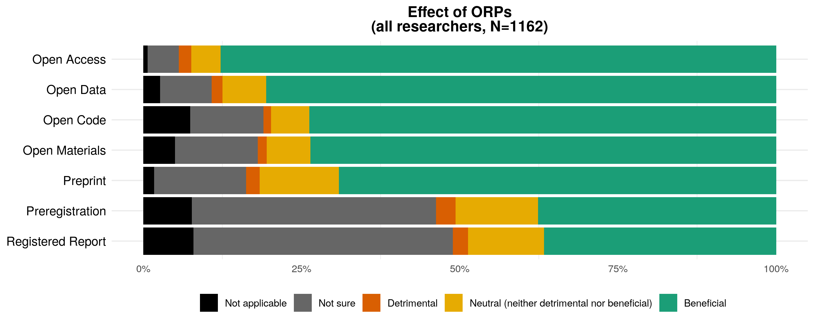
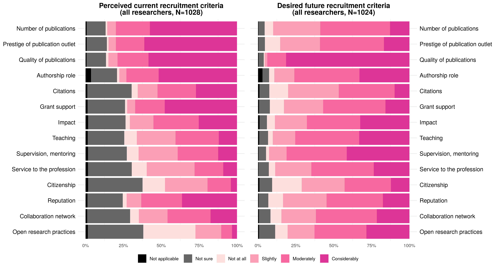
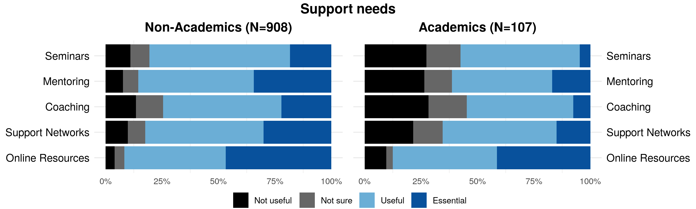

```{=html}
<style>
body {
text-align: justify}
</style>
```
```{=html}
<style type="text/css">
h1.title {
  text-align: center;
}

</style>
```
```{r setup, include=FALSE}
library(flextable)
library(tidyverse)
library(here)
library(knitr)
library(officer)
library(bookdown)

set_flextable_defaults(
  #table.layout = "autofit",
  digits = 1,
  font.color = "black",
  font.family = "Calibri", 
  font.size = 10,
  line_spacing = 1 # this argument doesn't seem to work.
  )

options(dplyr.summarise.inform = FALSE) # Suppress summarise info 'summarise() has grouped output by '
```

<br>

Broadly, open research (also called 'open scholarship' or, in some disciplines, 'open science') refers to efforts to ensure that different elements of the research process are transparent and accessible.

### Open research practices

What Reproducible Research Oxford has been promoting so far are practices like Open Access publishing, Data, Code, and Material sharing, and use of Preprint, Preregistration, and Registered Reports. Definitions of relevant terms vary across fields of research and contexts, so here are the definitions we propose:

**Open Access publication** An article, book chapter, book, or other scholarly work that is released with unrestricted access (i.e. available to the public to view online, or download, without registration, payment, or approval). This includes all forms of open access, such as 'green' (i.e. the accepted version of the work, after peer review, is shared by the author(s) in a repository), and 'gold' (i.e. the version processed by the publisher is released openly on the publisher's system upon publication).

**Data** Any information underpinning a piece of research. The information can be qualitative (e.g. source, archive, representation of art, artefact) and/or quantitative (e.g. measurements, machine output, simulation results). The data can be raw (i.e. as collected), cleaned (i.e. corrected for errors), or prepared/processed (e.g. transformed into a different format for analysis, or anonymized for sharing).

**Code** Custom software developed by researchers specifically for the purpose of conducting a piece of research (e.g. a computer program to extract, clean, or analyse data, or to generate simulation results), or to build components of a research data infrastructure (e.g. a data repository).

**Materials** Any element of the research process that can be coded digitally or shared physically (e.g. protocols, survey questions, instructions, intervention materials, videos of the study procedure, specimens, reagents, samples, and other items used to collect data and/or conduct the research).

**Preprint** An article, book chapter, book, or other scholarly work that is deposited in a repository ahead of peer review. Equivalent terms used in some disciplines are 'working papers' and 'unpublished manuscripts'.

**Preregistration** The practice by which researchers specify elements of the planned work in a dedicated registry before observing the outcomes of the work. Examples include description of the planned approach for a qualitative study, and the data analysis plan for a quantitative study (i.e. a 'pre-analysis plan', which can be submitted either before the start of data collection or for previously collected datasets, before the start of data analysis).

**Registered report** A journal article format in which research question(s) and methodology are peer-reviewed before the work is conducted. A submission may be provisionally accepted for publication following peer-review, and eventually published if the authors follow through with the methodology specified in the accepted version (deviations from the registered plan are allowed, but they must be explicitly justified and noted as such). Acceptance of the article to the journal is therefore independent of the results obtained.

The purpose of the last two practice is to provide a transparent documentation, for instance, of the evolution of one's positionality for qualitative research; but in the case of quantitative research, the main reason to engage with this practice is to be able to distinguish between a priori confirmatory analyses, that test hypotheses and have a declared alpha of usually 5%, i.e. we tolerate to have a 5% chance for a statistical test to result in a false-positive finding, vs exploratory analyses that have a higher rate of false-positive results but have the advantages of generating hypotheses.

### Survey adminsitration

We developed a survey to assess the views of Oxford researchers on these **open research practices**, related **training needs and provision**, as well as on **recruitment criteria**.

The first round was aimed at post-graduate research (PGR) students based in any Divisions of the University and was administered between 12 January 2021 and 1 March 2021. The second round was administered between 12 January 2022 and 1 March 2022 and targeted all researchers in all Divisions and Colleges, i.e.\
- **Students of post-graduate research programme** (PGR, e.g. MSc by Research; MPhil; DPhil; EPSRC CDT; NERC DTP; BBSRC DTP; DClinPsych);\
- **Research Staff or Research Fellow** (e.g. Clinical Researcher; Postdoctoral Researcher; Postdoctoral Research Assistant; Research Associate; Research Council Fellow [Senior, Advanced, Postdoctoral]; Research Fellow; Royal Society Fellow; Royal Society Research Professor; Clinical Research Fellow; Wellcome Trust Fellow);\
- **Research Support Staff** (e.g. Academic Clinical Trials Coordinator; Bioinformatician; Data Analyst; Statistician; Clinical Research Coordinator; Clinical Trials Coordinator/Officer/Manager; Knowledge Exchange Fellow/Officer; Laboratory Manager; Programme Manager; Research Analysis Officer; Research Project Manager; Research Coordinator; Research Facilitator; Science Liaison Officer; Science Officer; Theme Coordinator);\
- **Academic** (e.g. Associate Professor; Clinical Academic Staff; Clinical Lecturer; Departmental Lecturer; Professor; Reader; Head of Division).

### Sample sizes

```{r, echo = FALSE, include = FALSE}
source(here::here("Rscripts","FormatData.R"))
```

Participation in the survey was voluntary and all responses were anonymous. This means that, while the survey was advertised in all departmental newsletters (as well as other channels), people self-elected to participate; and biases in favour of people already aware of these practices and possibly favourable towards them can be expected. In addition, respondents anonymity also means that we are unable to know whether some researchers (particularly PGR students) participated in the survey in both years.

Table \@ref(tab:tabSS) shows the number of respondents per round given their role, as well as the range (minimum and maximum) of the possible unique numbers of respondents over both years (i.e. assuming all or none of the respondents participated in both years). The table also shows the census of each researcher group as extracted from the 2019 official census (with numbers unofficially revised and communicated by Divisional graduate student coordinators in 2021 for PGR students, and by the Researcher Hub in 2020 for research staff and fellows). The last column is the percentage of researchers that participated in the survey, per categories, and pooled over both years.

```{r, echo = FALSE, include = TRUE}
N %>% flextable() %>% 
    set_caption(caption = "Number of survey participants per round",
                style = "Table Caption", 
                autonum = run_autonum(seq_id = "tab", bkm = "tabSS")) %>% autofit()
```

Given the total number of researchers that had the opportunity to engage with the survey, and the proportion of respondents, it is unlikely that e.g. all students that responded in the second year also responded in the first year. In addition, PGR students patterns of responses in the second year looked similar to those in the first year. <!--# this needs checking again and for all questions at the end of data collection. --> Therefore, the data was pooled across both years, and the cumulative sample size (max N) will be used.

Note that we have rather low absolute numbers for research support staff so while their responses will contribute to the total results, they will not be displayed in isolation as this could be misleading, especially when the results are also split per Divisions.

Table \@ref(tab:tabSSdiv) shows the number of responses in each of the Divisions (Humanities abbreviated by '**Hum**'; Mathematical, Physical, and Life Sciences by '**MPLS**'; Medical Sciences by '**MSD**'; Social Sciences by '**SSD**'; Department for Continuing Education by '**ContEd**'; Gardens, Libraries, and Museums, by '**GLAM**'), as well as responses from **College-only staff**. Note that college-only staff that also selected the Division that they thought their field of research is the closest too, were added to the tally from each Division.

```{r, echo = FALSE, include = TRUE}
N_div %>% flextable() %>% 
    set_caption(caption = "Number of survey participants per Division",
                style = "Table Caption", 
                autonum = run_autonum(seq_id = "tab", bkm = "tabSSdiv")) %>% autofit()
```

We had the most responses from MPLS and MSD in terms of absolute numbers, then half of that for SSD and a third of that for Hum (but with still comparable level of percentages of the target population for the Humanities), and then a few responses from GLAM, ContEd, and College-only staff that did not associate with a Division. All of the data will be used for overall results, but when showing plots with the data split per Division, only the data of the 4 main academic Divisions will be used.

In total, we had **`r N_div$BothRounds[N_div$Div == 'Total']`** participants in the survey. More precisely, this is the number of participants that answered the two mandatory questions: Role and Affiliation. We kept respondents' answers whether they completed the survey or not. This means sample size slightly decline question after questions. The attrition rate (the percentage of participants dropping out of the survey after the first 2 mandatory questions and up to the last question) was `r sst_data$Total[sst_data$Question == 'PercDrop']`% on average, and increased from MSD, to MPLS, SSD, and the Humanities Division (see Table \@ref(tab:tabSSdivQ)). By the final question, we had **`r sst_data$Total[sst_data$Question == 'Support']`** remaining respondents (Table \@ref(tab:tabSSdivQ)).

```{r, echo = FALSE, include = TRUE}
sst_data[c(1:9, 12,13),c(1,7,6,8,5,9)] %>% flextable() %>% 
    set_caption(caption = "Number of survey participants per Division and per question",
                style = "Table Caption", 
                autonum = run_autonum(seq_id = "tab", bkm = "tabSSdivQ")) %>% autofit()
```

<br>

### Awareness of open research practices

The first question asked, after respondents' affiliation and role, was:

"**Which of the following research practices are you aware of, and which do you have experience with?** 'Aware only' indicates that the practice is applicable to your discipline, but you do not have direct experience with it. 'Accessing/using only' refers to resources made available by others. 'Practising myself' relates to implementation of the practice in your own research (in addition to, or instead of, accessing/using resources made available by others)."

```{r, echo = FALSE, include = FALSE}
source(here::here("Rscripts","Awareness.R"))

all_not_aware_OA <- round(All_Grouped_Awareness_for_plotting$perc[All_Grouped_Awareness_for_plotting$LabelIndiv == 'Open Access' & All_Grouped_Awareness_for_plotting$Answer == 'Not aware / not sure if applicable'],1)

researchers_aware_dont_practice_OA <- round(All_allstaffdata_Awareness_for_plotting$perc[All_allstaffdata_Awareness_for_plotting$LabelIndiv == "Open Access" & All_Grouped_Awareness_for_plotting$Answer == "Accessing / using only"] + All_allstaffdata_Awareness_for_plotting$perc[All_allstaffdata_Awareness_for_plotting$LabelIndiv == "Open Access" & All_allstaffdata_Awareness_for_plotting$Answer == "Aware only"],1)

```

Figure \@ref(fig:awareness) shows awareness and usage of open research practices (ORPs) for PGR students vs all other researchers, i.e. research staff or fellow, research support staff, and academics combined. These researchers were pooled because research staff and academics results show similar patterns (and that we only had very low sample sizes for research support staff).

In this figure we can see that the practice of each ORPs (in green) shows roughly similar patterns between PGR students and researchers, but with researchers practicing them a lot more - which is rather trivial if we consider e.g. first year DPhil student's opportunity to have practised them.

![(\#fig:awareness) Distribution of responses for awareness of ORPs across Divisions for PGR students vs all other researchers combined (i.e. research staff and fellows, research support staff, and academics). PGR students: MSD = `r sst_pgrdata$MSD[sst_pgrdata$Question == "Awareness" ]`, MPLS = `r sst_pgrdata$MPLS[sst_pgrdata$Question == "Awareness" ]`, SSD = `r sst_pgrdata$SSD[sst_pgrdata$Question == "Awareness"]`, Hum = `r sst_pgrdata$Hum[sst_pgrdata$Question == "Awareness"]`; Researchers: MSD = `r sst_allstaffdata$MSD[sst_allstaffdata$Question == "Awareness" ]`, MPLS = `r sst_allstaffdata$MPLS[sst_allstaffdata$Question == "Awareness" ]`, SSD = `r sst_allstaffdata$SSD[sst_allstaffdata$Question == "Awareness"]`, Hum = `r sst_allstaffdata$Hum[sst_allstaffdata$Question == "Awareness"]`](../Figures/Round12_Double_Awareness-per-ORP.png)

Overall, **Open Access** publishing was indicated to be the most practised among PGR students and researchers, and only `r all_not_aware_OA`% of all respondents indicated that they were not aware of it or not sure whether this practice was applicable to their work. However, there was still a significant proportion of respondents, even in researchers with the opportunity to practice OA (`r researchers_aware_dont_practice_OA`% of researchers), who were aware (in orange) or accessing (in yellow) open access publications but who did not practice it themselves.

**Preprinting** and **sharing of data** was the next most practised ORPs. We had large disparities between Divisions for **code sharing** practices. And overall, **preregistration** and **registered report** were the least well-known ORPs.<!--# FIXME should I say anything more? add numbers?-->

### Overall effect of open research practices

```{r, echo = FALSE, include = FALSE}
source(here::here("Rscripts","Effect.R"))

beneficial_all <- round(summary(All_Grouped_Effect_for_plotting$perc[All_Grouped_Effect_for_plotting$Answer == "Beneficial"]),1)
detrimental_all <- round(summary(All_Grouped_Effect_for_plotting$perc[All_Grouped_Effect_for_plotting$Answer == "Detrimental"]),1)

Hum_OA_Detrimental <- round(allstaffdata_Effect_for_plotting$perc[allstaffdata_Effect_for_plotting$LabelIndiv == "Open Access" & allstaffdata_Effect_for_plotting$Div == "Hum" & allstaffdata_Effect_for_plotting$Answer == "Detrimental"],1)
Hum_Preprint_Detrimental <- round(allstaffdata_Effect_for_plotting$perc[allstaffdata_Effect_for_plotting$LabelIndiv == "Preprint" & allstaffdata_Effect_for_plotting$Div == "Hum" & allstaffdata_Effect_for_plotting$Answer == "Detrimental"],1)

```

The next question we asked was:

"**In your opinion, what would be the overall effect of widespread adoption of the following practices in your field of research?**"

In Figure \@ref(fig:effect-single), we can see that the vast majority of respondents (on average `r beneficial_all[4]`%, ranging from `r beneficial_all[1]`% to `r beneficial_all[6]`%) found that the overall effect of the widespread adoption of these open research practices would be beneficial, while very few found that it would be overall detrimental (on average `r detrimental_all[4]`%, ranging from `r detrimental_all[1]`% to `r detrimental_all[6]`%). Lower levels of favourable opinions did not correspond to a higher level of unfavourable opinions but to a large proportion of respondents who indicated they were unsure about what the overall effect the widespread adoption of a specific open research practice would be. This pattern of 'uncertainty' from respondents matches well the patterns of lower awareness shown for measures such as Preregistration and Registered Reports. <!--# this is just comparing the 2 plots; not within individual correlation -->



When looking at Divisions separately in Figure \@ref(fig:effect-double), the previous observations still prevails: respondents were largely thinking that the overall effect of widespread adoption would be beneficial, unless they were unaware of the practice and therefore unsure about its effect (as seems to indicate the pattern match between these results and the results of the awareness question).

Notable patterns of detrimental effects can be seen for **Open Access publishing** and **Preprinting** in the Humanities, representing `r Hum_OA_Detrimental`% and `r Hum_Preprint_Detrimental`% of the research staffs and academics (and support staff) in the Humanities, respectively.

![(\#fig:effect-double) Presumed overall effect of ORPs widespread adoption on the field of research of respondents; PGR students vs all other researchers combined (i.e. research staff and fellows, research support staff and academics). PGR students: MSD = `r sst_pgrdata$MSD[sst_pgrdata$Question == "Effect" ]`, MPLS = `r sst_pgrdata$MPLS[sst_pgrdata$Question == "Effect" ]`, SSD = `r sst_pgrdata$SSD[sst_pgrdata$Question == "Effect"]`, Hum = `r sst_pgrdata$Hum[sst_pgrdata$Question == "Effect"]`; Researchers: MSD = `r sst_allstaffdata$MSD[sst_allstaffdata$Question == "Effect" ]`, MPLS = `r sst_allstaffdata$MPLS[sst_allstaffdata$Question == "Effect" ]`, SSD = `r sst_allstaffdata$SSD[sst_allstaffdata$Question == "Effect"]`, Hum = `r sst_allstaffdata$Hum[sst_allstaffdata$Question == "Effect"]`](../Figures/Round12_Double_Effect-per-ORP.png)

### Downsides to widespread adoption of open research practices

```{r, echo = FALSE, include = FALSE}
source(here::here("Rscripts","Downsides.R"))

no_downsides <- round(summary(All_Grouped_Downsides_for_plotting$perc[All_Grouped_Downsides_for_plotting$Answer == 'No']),1)
yes_downsides <- round(summary(All_Grouped_Downsides_for_plotting$perc[All_Grouped_Downsides_for_plotting$Answer == 'Yes']),1)

science_researchers_OA_downsides <- round(summary(allstaffdata_Downsides_for_plotting$perc[allstaffdata_Downsides_for_plotting$LabelIndiv == 'Open Access' & 
                                                                                             allstaffdata_Downsides_for_plotting$Div %in% c('MSD', 'SSD', 'MPLS') &
                                                                                             allstaffdata_Downsides_for_plotting$Answer == 'Yes']), 1)
hum_researchers_OA_downsides <- round(allstaffdata_Downsides_for_plotting$perc[allstaffdata_Downsides_for_plotting$LabelIndiv == 'Open Access' & 
                                                                                             allstaffdata_Downsides_for_plotting$Div %in% c('Hum') &
                                                                                             allstaffdata_Downsides_for_plotting$Answer == 'Yes'],1)

science_researchers_Data_downsides <- round(summary(allstaffdata_Downsides_for_plotting$perc[allstaffdata_Downsides_for_plotting$LabelIndiv == 'Open Data' & 
                                                                                             allstaffdata_Downsides_for_plotting$Div %in% c('MSD', 'SSD', 'MPLS') &
                                                                                             allstaffdata_Downsides_for_plotting$Answer == 'Yes']), 1)
```

Later on<!--# i.e. dowsnides question came after barriers questions; the rational was to reduce amount of respondent listing barriers in downsides question -->, to understand why respondents thought a specific ORP was overall detrimental, and to include any downsides other respondents may find for a specific ORP, even if they judged it overall beneficial, we asked:

"**In your view, are there *any* downsides to widespread adoption of the following practices in your field of research?** If so, please provide a brief description."

In Figure \@ref(fig:downside-single), we see more occurrences of detrimental aspects when asking about *any* possible downsides than simple the overall effect, as can be expected. Overall, the majority of respondents (on average `r no_downsides[4]`%, ranging from `r no_downsides[1]`% to `r no_downsides[6]`%) found that the widespread adoption of open research practices would have no downsides, while few found that it would (on average `r yes_downsides[4]`%, ranging from `r yes_downsides[1]`% to `r yes_downsides[6]`%). Lower levels of favourable opinions, like previously, did not correspond to a higher level of unfavorable opinions but to a large proportion of respondents who indicated they were unsure about whether a widespread adoption of open research practices would lead to any downsides.


In Figure \@ref(fig:downside-double), we can see that the ORPs that were judged by most respondents to have downsides (if they were to be widely adopted) were **Open Access** publishing and the **sharing of data**. Specifically, `r science_researchers_OA_downsides[4]`% of researchers on average in the three science Divisions, and `r hum_researchers_OA_downsides`% in the Humanities thought OA publishing had downsides; and `r science_researchers_Data_downsides[4]`% of researchers on average in the three science Divisions thought the sharing of data had downsides.

![(\#fig:downside-double) Existence of any downsides to the adoption of each ORP, as judged by PGR students vs all other researchers combined (i.e. research staff and fellows, research support staff, and academics). PGR students: MSD = `r sst_pgrdata$MSD[sst_pgrdata$Question == "Downsides" ]`, MPLS = `r sst_pgrdata$MPLS[sst_pgrdata$Question == "Downsides" ]`, SSD = `r sst_pgrdata$SSD[sst_pgrdata$Question == "Downsides"]`, Hum = `r sst_pgrdata$Hum[sst_pgrdata$Question == "Downsides"]`; Researchers: MSD = `r sst_allstaffdata$MSD[sst_allstaffdata$Question == "Downsides" ]`, MPLS = `r sst_allstaffdata$MPLS[sst_allstaffdata$Question == "Downsides" ]`, SSD = `r sst_allstaffdata$SSD[sst_allstaffdata$Question == "Downsides"]`, Hum = `r sst_allstaffdata$Hum[sst_allstaffdata$Question == "Downsides"]`](../Figures/Round12_Double_Downsides-per-ORP.png)

So what are these downsides?

#### What Downsides

```{r, echo = FALSE, include = FALSE}
source(here::here("Rscripts","OtherBarriersWhatDownsides.R"))
```

A free text box opened for each ORP a respondent had selected to have downsides. Their responses were roughly categorised, counted, and sorted in order of frequency in Table \@ref(tab:tblotherdownsides). <!--# this would need to be revised carefully to see if some categorisations were overwritten, whether some automation picked a word in a responses that should not be categorised this way, etc. Besides, last year, I tried to create large categories that could apply across ORPs for a better read of the table summarising the counts of downsides for each ORP; I haven't revised my categories this year yet to do the same regrouping work so it's a bit all over the place...--> A selection of representative quotes, or to the contrary, original quotes that I subjectively thought were relevant, are also included below.

The main downside to **Open Access** publications frequently mentioned by respondents was the extreme cost of Gold OA, and the inequalities between researchers/fields/institutions that it creates depending on whether they have or do not have access to funding. In addition, the mandates or moves to OA from funders and researchers, and the possibility for publishers to ask high APCs were believed to generate predatory behaviours from publishing companies, and to possibly lead to less invested editorial reviews (or even less invested peer-review in general given the quantity or articles submitted and sent for review to generate income for publishers), and therefore, to possibly lower the quality of research being published. Some respondents also thought they were less options of prestigious journals that published OA<!--# more of an infrastructure barrier, mentioned again there?-->. Finally, some respondents were concerned about the loss of income for scholarly society, authors, or publishers, if, for instance books or monographs, were available for free online.

Some quotes:\
1. "*`r quote_WD_OA_1`*"\
2. "*`r quote_WD_OA_5`*"\
3. "*`r quote_WD_OA_6`*"\
4. "*`r str_replace(quote_WD_OA_7, "\n\n", " ")`*" <!--# shorten quote with "[...]"--> 5. "*`r quote_OB_OA_4`*" <!--# cut?--> 6. "*`r quote_WD_OA_8`*"\

Downsides to **Data sharing** were many concerns over ethics, safety, or security (e.g. to preserve human participants anonymity) and the inability to control the validity of reuse, or the possible misrepresentation or misuse of the data shared. There were also relatively frequent concerns over intellectual property, fear of scooping, and general lack of recognition for the effort and cost of collecting primary data, especially if there were to be reused before the producing team was able to exploit their dataset fully in terms of article published. Less frequent concerns, but worth noting<!--# more of a lack of norm barrier, mentioned again there?-->, respondents highlighted a lack of norm for dataset citation, a lack of metadata standards to make data sharing usable, and the fact that some data can be in proprietary format only; both of latter making data sharing less useful or even irrelevant.

Some quotes:\
1. "*`r quote_WD_Data_1`*"\
2. "*`r quote_WD_Data_2`*"\
3. "*`r quote_WD_Data_3`*"\
4. "*`r quote_WD_Data_4`*"\
5. "*`r quote_WD_Data_5`*"\
6. "*`r quote_WD_Data_6`*"\

Downsides to **Code sharing** were, similarly to data sharing, IP concerns, the fact that such academic outputs aren't credited or recognised if reused by others, the absence of control over the validity of reuse, and ethical, safety, or security concerns. In addition, respondents mentioned that given that currently, research software aren't reviewed, having them available for reuse could lower the quality of follow-up research. Less frequent, but worth noting, some respondents mentioned the psychological toll of having their code scrutinised and criticized by the community.

Some quotes:\
1. "*`r quote_WD_Code_1`*"\
2. "*`r quote_WD_Code_2`*"\
3. "*`r quote_WD_Code_3`*"\
4. "*`r quote_WD_Code_4`*"\

Downsides to **Material sharing** were ethical, safety, or security concerns (and possibly including laws against it<!--# more of a barrier, mentioned again there?-->), IP concerns, absence of control over the validity of reuse or misuse, scooping and lack of credit/recognition. In addition, respondents mentioned the potential huge cost of maintenance, and the unlikelihood of being able to provide equitable access to all.

Some original quotes highlighting some specific problems with physical material sharing:\
1. "*`r quote_WD_Materials_1`*"\
2. "*`r quote_WD_Materials_2`*"\
3. "*`r quote_WD_Materials_3`*"\
4. "*`r quote_WD_Materials_4`*" <!--# not sure this one is physical-->

The main downside to **Preprints** was the fact that they are disseminated and potentially used for policies or further research before being peer-reviewed (if they ever get peer-reviewed) and therefore potentially containing errors or misleading readers. In lesser frequency but worth noting, other downsides listed were the fear of scooping, the race to publish first (possibly lowering the quality of the publication), the fact that it sometimes prevents formal publishing, concerns over the extreme growth of the literature on preprint servers, interference with double-blind peer-reviewing, and problem with updating citation (given duplicate versions).

Some quotes:\
1. "*`r quote_WD_Preprint_1`*"\
2. "*`r quote_WD_Preprint_2`*"\
3. "*`r quote_WD_Preprint_3`*"\
4. "*`r quote_WD_Preprint_4`*"\
5. "*`r quote_WD_Preprint_5`*"\
6. "*`r quote_WD_Preprint_6`*"\
7. "*`r quote_WD_Preprint_7`*"\
8. "*`r quote_WD_Preprint_8`*"\

Regarding **Preregistration**, the main downsides described by respondents were that it was thought to impede exploratory research, impede flexibility in protocols while the research is being conducted, and that this practice is not applicable to all fields of research (for isntance, it does not align with iterative development of research questions in e.g. social sciences). In lesser frequency but worth noting, respondents mentioned that there need to be a corresponding increase in respect for null findings, and that if preregistration are made public before publication, it may deter unknowing replication.

Some quotes:\
1. "*`r quote_WD_Prereg_1`*"\
2. "*`r quote_WD_Prereg_2`*"\
3. "*`r quote_WD_Prereg_3`*"\
4. "*`r quote_WD_Prereg_4`*"\
5. "*`r quote_WD_Prereg_5`*"\
6. "*`r quote_WD_Prereg_6`*"\
7. "*`r quote_WD_Prereg_7`*"\
8. "*`r quote_WD_Prereg_8`*"\

Downsides to **Registered Reports** were the same as those for preregistration. In addition, some respondents noted that it delays the start of data collection to allow for peer-review of the introduction and methods.

Some quotes:\
1. "*`r quote_WD_RegRep_1`*"\
2. "*`r quote_WD_RegRep_2`*"\
3. "*`r quote_WD_RegRep_3`*"\
4. "*`r quote_WD_RegRep_5`*"\
5. "*`r quote_OB_Prereg_1`*"\
6. "*`r quote_WD_RegRep_6`*"\
7. "*`r quote_OB_RegRep_1`*"\

For both **Preregistration** and **Registered Reports**, given these quotes and others (also in 'Barriers'), and the fact that awareness of these practices were overall very low and that we know that training is extremely limited around the University for these practices, I wonder, whether fields (particularly experimental fields) where preregistration was judged not applicable or unjustifiably limiting flexibility in protocols, do in fact operate under the same framework (Ho testing, alpha = 0.05) as fields who have judged that preregistration is necessary to prevent insight bias, confirmation bias, and non-intentional insidious ways of p-hacking leading to drastic increases in the likelihood of obtaining false-positive results. Do fields rejecting preregistration have the same ideal but simply don't have the right research environment (sometimes in very practical terms as seen in some quotes) to be able to practice preregistration, or is it that these fields approach are different and preregistration isn't relevant, e.g. if the research process resemble the iterative processes judged as a valid norm in some social sciences. I think there may be both type of responses in the survey. As a reminder, when one conducts an experiment, one state that they have an a priori hypothesis, and that a specifically designed manipulation will explain differences observed between groups (e.g. treatment vs control groups). Even after reading all these replies, I personally still see no logical reasons (there may be very real practical barriers though), for experimental fields to not want to limit the flexibility in protocol or to not declare those deviations in order for readers to be able to assess the likelihood of each finding to be a false positive result (another reminder: each decision of conducting a statistical test based on the p value of a first test will inevitably increase the chances of the second test to be a false positive finding, over the 5% tolerated and declared rate).<!--# FIXME language to not be offensive-->

Perhaps further consultations, such as focus groups following an in depth introduction to preregistration would be needed to know whether the inability to create a plan a priori constitute a barrier (e.g. practical impossibility) over an actual downside (e.g. the practice is irrelevance). <!--# FIXME language to not be offensive-->

```{r, echo = FALSE, include = TRUE}
tblotherdownsides <- Alldata_WD_table %>% flextable() %>%
    set_caption(caption = "Downsides to adoption of ORPs (categorised from free text boxes)",
                style = "Table Caption",
                autonum = run_autonum(seq_id = "tab", bkm = "tblotherdownsides"))
tblotherdownsides <- width(tblotherdownsides, j = c(1, 2:9), width = c(8, 1,1,1,1,1,1,1,1), unit = "cm")
tblotherdownsides <- flextable::rotate(tblotherdownsides, j = 2:9, rotation = "btlr", align = "center", part = "header")
tblotherdownsides <- valign(tblotherdownsides, valign = "center", part = "header")
h_header <- max( dim_pretty(tblotherdownsides, part = "header")$widths )
tblotherdownsides <- height(tblotherdownsides, height = h_header * 1.1, part = "header")
tblotherdownsides <- hrule(tblotherdownsides, i = 1, rule = "exact", part = "header")
tblotherdownsides
```

Overall, despite these numerous downsides, remember that people seemed to think ORPs were largely favourable, at least for those that were known to them. So why aren't they more practised? Are they any barriers to adoptions?

### Barriers to adoption of open research practices

```{r, echo = FALSE, include = FALSE}
source(here::here("Rscripts","Barriers.R"))

SSD_Hum_OA_Incentives <- round(mean(alldata_Barriers_for_plotting_forOA$perc[alldata_Barriers_for_plotting_forOA$Div %in% c('SSD', 'Hum') &
                                                                              alldata_Barriers_for_plotting_forOA$Answer == 'Incentives']), 1)
MSD_MPLS_OA_Incentives <- round(mean(alldata_Barriers_for_plotting_forOA$perc[alldata_Barriers_for_plotting_forOA$Div %in% c('MSD', 'MPLS') &
                                                                              alldata_Barriers_for_plotting_forOA$Answer == 'Incentives']), 1)
SSD_Hum_OA_Infrastructure <- round(mean(alldata_Barriers_for_plotting_forOA$perc[alldata_Barriers_for_plotting_forOA$Div %in% c('SSD', 'Hum') &
                                                                              alldata_Barriers_for_plotting_forOA$Answer == 'Infrastructure']), 1)
MSD_MPLS_OA_Infrastructure <- round(mean(alldata_Barriers_for_plotting_forOA$perc[alldata_Barriers_for_plotting_forOA$Div %in% c('MSD', 'MPLS') &
                                                                              alldata_Barriers_for_plotting_forOA$Answer == 'Infrastructure']), 1)
allDiv_notOA_Training <- round(summary(All_Grouped_Barriers_for_plotting$perc[All_Grouped_Barriers_for_plotting$LabelIndiv != "Open Access"  &
                                                                            All_Grouped_Barriers_for_plotting$Answer == 'Training']), 1)
allDiv_notOA_Norms <- round(summary(All_Grouped_Barriers_for_plotting$perc[All_Grouped_Barriers_for_plotting$LabelIndiv != "Open Access"  &
                                                                            All_Grouped_Barriers_for_plotting$Answer == 'Norms']), 1)
allDiv_notOA_Incentives <- round(summary(All_Grouped_Barriers_for_plotting$perc[All_Grouped_Barriers_for_plotting$LabelIndiv != "Open Access"  &
                                                                            All_Grouped_Barriers_for_plotting$Answer == 'Incentives']), 1)
allDiv_notOA_TNI <- round(summary(All_Grouped_Barriers_for_plotting$perc[All_Grouped_Barriers_for_plotting$LabelIndiv != "Open Access"  &
                                                                            All_Grouped_Barriers_for_plotting$Answer %in% c('Incentives', "Norms", 'Training')]), 1)
allDiv_notOA_Policy <- round(summary(All_Grouped_Barriers_for_plotting$perc[All_Grouped_Barriers_for_plotting$LabelIndiv != "Open Access"  &
                                                                            All_Grouped_Barriers_for_plotting$Answer == "Policy"]), 1)
allDiv_notOA_Infrastructure <- round(summary(All_Grouped_Barriers_for_plotting$perc[All_Grouped_Barriers_for_plotting$LabelIndiv != "Open Access"  &
                                                                            All_Grouped_Barriers_for_plotting$Answer == "Infrastructure"]), 1)

```

Different factors may contribute to the adoption of open research practices, including:

-   infrastructure, i.e. tools, resources, and/or services that enable implementation of the practice (e.g. repositories for digital or physical storage; registries for preregistration; publishing platforms or outlets) and of relevant community standards (e.g. guidelines relating to citation of data and metadata; ethical and legal guidelines for sharing sensitive data);

-   training, i.e. the acquisition of knowledge and/or skills needed to implement the practice;

-   norms, i.e. widespread attitudes and behaviours that support and/or encourage the practice (e.g. the perception that the field is aware of the practice and in favour of implementation; interest from early-career researchers; support from supervisors, mentors);

-   incentives, i.e. resources and/or mechanisms that reward the practice (e.g. dedicated funding, awards; institutional recognition);

-   policy, i.e. a requirement to implement the practice by relevant stakeholders (e.g. institutions, funders, publishers).

Time may be perceived as an additional factor contributing to adoption of a practice. Rather, we consider availability of time, or lack thereof, as a consequence of the factors listed above. For example, a researcher may choose to invest the time required to adopt a practice depending on:

-   the availability of infrastructure or training, which facilitate implementation;

-   the existence of norms in the community, which mitigate the burden on the researcher;

-   the presence of incentives, or policy, which reward and/or mandate the practice in the researcher's field or institution.

In light of this, we asked:

"**Do you face any barriers in adopting the following practices and, if so, what are they?** Tick all that apply and/or provide a brief description for any others."

Although there were some differences between Divisions, overall responses from students, research staff, and academics showed roughly similar patterns and therefore were merged (with research support staff which have very low sample sizes) in Figure \@ref(fig:barrier-single). The plots shown below aren't stacked bar plots like in previous questions where respondents could only select one response; in this case, responses were not mutually exclusive. Given these bar plots are now dodged, I will not be showing differences in Divisions here, as it becomes a bit complicated to look at.


**Open Access** publishing's main barrier was considered to be the lack of incentives, and this was particularly so in the Humanities and Social Sciences Divisions across students and researchers (`r SSD_Hum_OA_Incentives`% vs `r MSD_MPLS_OA_Incentives`%; see Figure \@ref(fig:barrier-single-OA)). In the Social sciences and Humanities Division, respondents were also more likely than in the other two Divisions to select additional barriers to adoption of OA publishing, particularly a lack of infrastructure (`r SSD_Hum_OA_Infrastructure`% vs `r MSD_MPLS_OA_Infrastructure`%; see Figure \@ref(fig:barrier-single-OA)).

![(\#fig:barrier-single-OA) Barriers to adoptions of Open Access publishing (non-mutually exclusive), with responses pooled across all types of researchers and split per Divisions. MSD:`r Nalldata_Barriers_forOA_perDiv$N[Nalldata_Barriers_forOA_perDiv$Div == 'MSD']`, MPLS:`r Nalldata_Barriers_forOA_perDiv$N[Nalldata_Barriers_forOA_perDiv$Div == 'MPLS']`, SSD:`r Nalldata_Barriers_forOA_perDiv$N[Nalldata_Barriers_forOA_perDiv$Div == 'SSD']`, Hum:`r Nalldata_Barriers_forOA_perDiv$N[Nalldata_Barriers_forOA_perDiv$Div == 'Hum']`](../Figures/Round12_Single_splitDiv_Barriers_for_OA.png){width="400px"}

For all the other ORPs, training, norms, and incentives, were the major barriers perceived across Divisions (on average: `r allDiv_notOA_TNI[4]`%, range: `r allDiv_notOA_TNI[1]`% - `r allDiv_notOA_TNI[6]`%), followed by policies (average: `r allDiv_notOA_Policy[4]`%,range: `r allDiv_notOA_Policy[1]`% - `r allDiv_notOA_Policy[6]`%), and infrastructure (average: `r allDiv_notOA_Infrastructure[4]`%,range: `r allDiv_notOA_Infrastructure[1]`% - `r allDiv_notOA_Infrastructure[6]`%; see Figure \@ref(fig:barrier-single)).

#### What Barriers

```{r, echo = FALSE, include = FALSE}
source(here::here("Rscripts","OtherBarriersWhatDownsides.R"))
```

Free text boxes opened for each ORP a respondent selected to have other barriers. Their responses were roughly categorised, counted, and sorted in order of frequency in Table \@ref(tab:tblotherbarriers). <!--# this would need to be revised carefully to see if some categorisations were overwritten, whether some automatisation picked a word in a responses that should not be categorised this way, etc. Besides, last year, I tried to create large categories that could apply accross ORPs for a better read of the table summarising the counts of downsides for each ORP; I haven't revised my categories this year to do the same regrouping work so it's a bit all over the place...--> A selection of representative quotes, or to the contrary, original quotes, are also included below.

The most frequently mentioned other barrier to **Open Access** publications was the cost of Gold OA. In much lower frequency, additional barriers indicated by respondents were the lack of prestigious journals that offered OA options, and, given the rapid changes in policies, the lack of clarity from University services on these policies, on the list of journals that offer OA, and on general relevant guidance to researchers.

Some quotes:\
1. "*`r quote_OB_OA_1`*"\
2. "*`r quote_OB_OA_2`*"\
3. "*`r quote_OB_OA_3`*"

Barriers to **Data sharing** were ethical concerns, the lack of ownership of the data, the lack of support (including financial support) to prepare data for sharing, the lack of metadata standards, the fact that original cost of collecting primary data isn't recognised nor protected from scooping, and the fact that repositories aren't user-friendly.

Some quotes:\
1. "*`r quote_OB_Data_1`*"\
2. "*`r quote_OB_Data_2`*"

The main extra barrier to **Code sharing** was the time it takes to prepare such resource for sharing.

Some quotes:\
1. "*`r quote_OB_Code_1`*"

Barriers specific to **Material sharing** were ethical and safety concerns, difficult resource management, the lack of funding to store the resource, and the fact that the resource isn't always digital.

Some quotes:\
1. "*`r quote_OB_Materials_1`*"

Barriers to **Preprints** were IP concerns and the lack of peer-review as we saw in downsides. An additional noteworthy mention was that preprint aren't recognised as meeting OA requirements (e.g. for REF).

Some quotes:\
1. "*`r quote_OB_Preprint_1`*"

Barriers to **Preregistration** were the fact that it isn't adapted to all disciplines, the lack of fund, for instance to run pilot experiment before writing a preregistration, and the fear of scooping.

Some quotes:\
1. "*`r quote_OB_Prereg_1`*"  <!--# mentioned above --> 2. "*`r quote_OB_Prereg_2`*"\

Barriers to **Registered Reports** were the same as for preregistration. Additional barriers were the delayed start of data collection, which does not allow ECRs on short time contracts to engage with the practice; the fact that it may be too much work for peer-reviewers, and the lack of suitable journals that offer this publishing format in some fields.

Some quotes:\
1. "*`r quote_OB_RegRep_1`*" <!--# mentioned above --> 2. "*`r quote_OB_RegRep_2`*"\

```{r, echo = FALSE, include = TRUE}
tblotherbarriers <- Alldata_OB_table %>% flextable() %>%
    set_caption(caption = "Other barriers to adoption of ORPs (categorised from free text boxes)",
                style = "Table Caption",
                autonum = run_autonum(seq_id = "tab", bkm = "tblotherbarriers"))
tblotherbarriers <- width(tblotherbarriers, j = c(1, 2:9), width = c(8, 1,1,1,1,1,1,1,1), unit = "cm")
tblotherbarriers <- flextable::rotate(tblotherbarriers, j = 2:9, rotation = "btlr", align = "center", part = "header")
tblotherbarriers <- valign(tblotherbarriers, valign = "center", part = "header")
h_header <- max( dim_pretty(tblotherbarriers, part = "header")$widths )
tblotherbarriers <- height(tblotherbarriers, height = h_header * 1.1, part = "header")
tblotherbarriers <- hrule(tblotherbarriers, i = 1, rule = "exact", part = "header")
tblotherbarriers
```

These were additional barriers mentioned by some respondents. Overall, the main barriers to adoptions of ORPs were the lack of training, norms, and incentives as seen in the previous section. We asked further questions to explore these barriers in more details.

### Recruitment criteria

```{r, echo = FALSE, include = FALSE}
source(here::here("Rscripts","RecruitmentCombined.R"))
```

One way of incentivising a practice in the academic system, is to use it as a part of recruitment criteria.

However, creating appropriate research assessment criteria is a very complex task, and we can't simply keep adding criteria; we may need to rethink the entire system. For instance, there are several metrics initially created with the intend to reflect the productivity of researchers and the quality of their input, such as the number of publications and the impact factor of the journals they were published in, which are now judged to be 1. misleading research assessment criteria and 2. leading to a very unhealthy research environment. The San Francisco Declaration on Research Assessment (DORA), signed by the University of Oxford, was written to highlight this point and make recommendations to research institutions. The recommendations include the elimination of the use of journal-based metrics, such as journals' Impact Factors, in funding, appointment, and promotion considerations; and the assessment of research on its own merits rather than on the basis of the journal in which the research is published. The question remains as to how to assess research quality, and do so without asking more and more from already overstretched researchers. <!--# FIXME where am I getting at? How can I contextualise our survey question? should I just skip this background entirely? -->

The next two questions we asked were:

**To the best of your knowledge, to what extent *are* the following criteria used for recruitment in your field of research at Oxford?** Please list any additional criteria in the empty boxes below. <!--# FYI: a few respondents said these questions don't work because we don't specify the level of recruitment, and that criteria change e.g. for post doc vs tenured job; in the future we could say 'for permanent position' or so?-->

followed by:

**In your opinion, to what extent *should* the following criteria be used for recruitment in your field of research at Oxford?** Please list any additional criteria in the empty boxes below.

The criteria to score were:

-   Number of publications

-   Prestige of publication outlet

-   Quality of publications

-   Authorship role - (e.g. lead or senior author vs. contributing author)

-   Citations - (e.g. total number, h-index)

-   Grant support - (e.g. total amount, source)

-   Impact - (e.g. policy, medical applications, patents, media coverage)

-   Teaching - (e.g. amount, quality, creation of materials)

-   Supervision, mentoring - (e.g. amount, quality)

-   Service to the profession - (e.g. editorial work, contributions to the work of professional bodies or learned societies)

-   Citizenship - (e.g. involvement in departmental or University committees)

-   Reputation - National and/or international reputation (e.g. recognition, awards)

-   Collaboration network - (e.g. size, strength)

-   Open research practices

All types of researchers from all Divisions agreed overall on the direction of change between currently used vs desirable recruitment criteria shown in Figure \@ref(fig:recruitment-combined). Namely, the importance of the number of publication, the prestige of outlet, and the amount or source of grant support should, according to respondents, drastically decrease, while the quality of publication should, according to them, be much more considerably taken into account when assessing researchers for recruitment at Oxford. Respondents also indicated that the importance of teaching, supervising and mentoring, and to some extend the use of open research practices should also increase when assessing researchers for recruitment. <!--# FIXME numbers?-->



Patterns or responses were similar between PGR students, research staff or fellows, and research support staff, and those patterns were slightly different from those shown by academics mostly for the fact the academics were overall less 'unsure' about currently used criteria. Given academics are the most likely researchers to have gone through a recruitment process for themselves and possibly involved in the recruitment of others, it probably makes more sense to present results split between academics and non-academic researchers for these two questions (see Figures \@ref(fig:recruitment-current) and \@ref(fig:recruitment-future)).

There are lots of interesting results that I'm happy to provide to the DORA implementation team, but I don't have time to go into all of these details now. Very briefly, they are differences between Divisions regarding the desired importance of among others, citation, impact, and teaching, the last two being an inverse mirror across Divisions (Figure \@ref(fig:recruitment-future)), etc. <!--# FIXME -->

```{r, echo = FALSE, include = FALSE}
Nnonacademic_MSD_Current <- sum(as.numeric(sst_pgrdata$MSD[sst_pgrdata$Question == "CurrentRecruitment" ]), 
                        as.numeric(sst_staffdata$MSD[sst_staffdata$Question == "CurrentRecruitment" ]),
                        as.numeric(sst_supportstaffdata$MSD[sst_staffdata$Question == "CurrentRecruitment" ]))
Nacademic_MSD_Current <- sst_academicdata$MSD[sst_pgrdata$Question == "CurrentRecruitment" ]

Nnonacademic_SSD_Current <- sum(as.numeric(sst_pgrdata$SSD[sst_pgrdata$Question == "CurrentRecruitment" ]), 
                        as.numeric(sst_staffdata$SSD[sst_staffdata$Question == "CurrentRecruitment" ]),
                        as.numeric(sst_supportstaffdata$SSD[sst_staffdata$Question == "CurrentRecruitment" ]))
Nacademic_SSD_Current <- sst_academicdata$SSD[sst_pgrdata$Question == "CurrentRecruitment" ]

Nnonacademic_MPLS_Current <- sum(as.numeric(sst_pgrdata$MPLS[sst_pgrdata$Question == "CurrentRecruitment" ]), 
                        as.numeric(sst_staffdata$MPLS[sst_staffdata$Question == "CurrentRecruitment" ]),
                        as.numeric(sst_supportstaffdata$MPLS[sst_staffdata$Question == "CurrentRecruitment" ]))
Nacademic_MPLS_Current <- sst_academicdata$MPLS[sst_pgrdata$Question == "CurrentRecruitment" ]

Nnonacademic_Hum_Current <- sum(as.numeric(sst_pgrdata$Hum[sst_pgrdata$Question == "CurrentRecruitment" ]), 
                        as.numeric(sst_staffdata$Hum[sst_staffdata$Question == "CurrentRecruitment" ]),
                        as.numeric(sst_supportstaffdata$Hum[sst_staffdata$Question == "CurrentRecruitment" ]))
Nacademic_Hum_Current <- sst_academicdata$Hum[sst_pgrdata$Question == "CurrentRecruitment" ]

Nnonacademic_MSD_Future <- sum(as.numeric(sst_pgrdata$MSD[sst_pgrdata$Question == "FutureRecruitment" ]), 
                        as.numeric(sst_staffdata$MSD[sst_staffdata$Question == "FutureRecruitment" ]),
                        as.numeric(sst_supportstaffdata$MSD[sst_staffdata$Question == "FutureRecruitment" ]))
Nacademic_MSD_Future <- sst_academicdata$MSD[sst_pgrdata$Question == "FutureRecruitment" ]

Nnonacademic_SSD_Future <- sum(as.numeric(sst_pgrdata$SSD[sst_pgrdata$Question == "FutureRecruitment" ]), 
                        as.numeric(sst_staffdata$SSD[sst_staffdata$Question == "FutureRecruitment" ]),
                        as.numeric(sst_supportstaffdata$SSD[sst_staffdata$Question == "FutureRecruitment" ]))
Nacademic_SSD_Future <- sst_academicdata$SSD[sst_pgrdata$Question == "FutureRecruitment" ]

Nnonacademic_MPLS_Future <- sum(as.numeric(sst_pgrdata$MPLS[sst_pgrdata$Question == "FutureRecruitment" ]), 
                        as.numeric(sst_staffdata$MPLS[sst_staffdata$Question == "FutureRecruitment" ]),
                        as.numeric(sst_supportstaffdata$MPLS[sst_staffdata$Question == "FutureRecruitment" ]))
Nacademic_MPLS_Future <- sst_academicdata$MPLS[sst_pgrdata$Question == "FutureRecruitment" ]

Nnonacademic_Hum_Future <- sum(as.numeric(sst_pgrdata$Hum[sst_pgrdata$Question == "FutureRecruitment" ]), 
                        as.numeric(sst_staffdata$Hum[sst_staffdata$Question == "FutureRecruitment" ]),
                        as.numeric(sst_supportstaffdata$Hum[sst_staffdata$Question == "FutureRecruitment" ]))
Nacademic_Hum_Future <- sst_academicdata$Hum[sst_pgrdata$Question == "FutureRecruitment" ]
```

{height="800px"}

{height="800px"}

```{r, echo = FALSE, include = FALSE}
nonacademic_ORP_notatall <- round(summary(All_Data_But_Academic_CurrentRecruitment_for_plotting$perc[
  All_Data_But_Academic_CurrentRecruitment_for_plotting$LabelIndiv == 'Open research practices' &
  All_Data_But_Academic_CurrentRecruitment_for_plotting$Div %in% Plotted_Div &
  All_Data_But_Academic_CurrentRecruitment_for_plotting$Answer == 'Not at all']),1)

nonacademic_ORP_notsure <- round(summary(All_Data_But_Academic_CurrentRecruitment_for_plotting$perc[
  All_Data_But_Academic_CurrentRecruitment_for_plotting$LabelIndiv == 'Open research practices' &
  All_Data_But_Academic_CurrentRecruitment_for_plotting$Div %in% Plotted_Div &
  All_Data_But_Academic_CurrentRecruitment_for_plotting$Answer == 'Not sure']),1)

academic_ORP_notatall <- round(summary(academicdata_CurrentRecruitment_for_plotting$perc[
  academicdata_CurrentRecruitment_for_plotting$LabelIndiv == 'Open research practices' &
  academicdata_CurrentRecruitment_for_plotting$Div %in% Plotted_Div &
  academicdata_CurrentRecruitment_for_plotting$Answer == 'Not at all']),1)

nonacademic_ORP_considered_perDiv <-  All_Data_But_Academic_FutureRecruitment_for_plotting[
  All_Data_But_Academic_FutureRecruitment_for_plotting$LabelIndiv == 'Open research practices' &
  All_Data_But_Academic_FutureRecruitment_for_plotting$Div %in% Plotted_Div &
  All_Data_But_Academic_FutureRecruitment_for_plotting$Answer %in% c('Slightly', 'Moderately','Considerably'),] %>% 
    group_by(Div) %>% 
  summarise (TotalPerc = round(sum(perc),1))
nonacademic_ORP_considered_av <- summary(nonacademic_ORP_considered_perDiv$TotalPerc)

academic_ORP_considered_perDiv <-  academicdata_FutureRecruitment_for_plotting[
  academicdata_FutureRecruitment_for_plotting$LabelIndiv == 'Open research practices' &
  academicdata_FutureRecruitment_for_plotting$Div %in% Plotted_Div &
  academicdata_FutureRecruitment_for_plotting$Answer %in% c('Slightly', 'Moderately','Considerably'),] %>% 
    group_by(Div) %>% 
  summarise (TotalPerc = round(sum(perc),1))
academic_ORP_considered_av <- summary(academic_ORP_considered_perDiv$TotalPerc)

nonMSD_academic_ORP_notatall_perDiv <-  academicdata_FutureRecruitment_for_plotting[
  academicdata_FutureRecruitment_for_plotting$LabelIndiv == 'Open research practices' &
  academicdata_FutureRecruitment_for_plotting$Div %in% c('SSD','MPLS','Hum') &
  academicdata_FutureRecruitment_for_plotting$Answer %in% c('Not at all'),] %>% 
    group_by(Div) %>% 
  summarise (TotalPerc = round(sum(perc),1))
nonMSD_academic_ORP_notatall_av <- summary(nonMSD_academic_ORP_notatall_perDiv$TotalPerc)

MSD_academic_ORP_notatall <-  academicdata_FutureRecruitment_for_plotting[
  academicdata_FutureRecruitment_for_plotting$LabelIndiv == 'Open research practices' &
  academicdata_FutureRecruitment_for_plotting$Div == 'MSD' &
  academicdata_FutureRecruitment_for_plotting$Answer %in% c('Not at all'),] %>% 
    group_by(Div) %>% 
  summarise (TotalPerc = round(sum(perc),1))
MSD_academic_ORP_notatall$TotalPerc

```

One of the criteria that showed the most differences between Divisions was actually 'open research practices' (Figure \@ref(fig:recruitment-combined-ORP)). Both the majority of non-academics, and academics thought that the use of ORPs isn't currently considered for recruitment (`r academic_ORP_notatall[4]` % of all academics, `r nonacademic_ORP_notatall[4]` % of all non-academics [with on average, an additional `r nonacademic_ORP_notsure[4]`% of non-academic being unsure whether this criteria is being used]), while a large proportion indicated that they thought it *should* be considered at least slightly (`r academic_ORP_considered_av[4]` % of all academics; `r nonacademic_ORP_considered_av[4]`% of all non-academics).

Academics across Divisions shows widely different opinions, with only \<`r MSD_academic_ORP_notatall$TotalPerc` MSD academics suggesting that ORP should not be considered at all, while on average `r nonMSD_academic_ORP_notatall_av[4]`% of academics in the other Divisions thought so. To contextualise this difference, one need to keep in mind the relatively low sample sizes of academics when split per Divisions; so I added this number of those bars in Figure \@ref(fig:recruitment-combined-ORP).

![(\#fig:recruitment-combined-ORP) Perceived current and desired future importance given to open research practices as a recruitment criteria. Current Criteria: Non-Academics: MSD = `r NallbutacademicCurrent_perDiv$N[NallbutacademicCurrent_perDiv$Div == 'MSD']`, MPLS = `r NallbutacademicCurrent_perDiv$N[NallbutacademicCurrent_perDiv$Div == 'MPLS']`, SSD = `r NallbutacademicCurrent_perDiv$N[NallbutacademicCurrent_perDiv$Div == 'SSD']`, Hum = `r NallbutacademicCurrent_perDiv$N[NallbutacademicCurrent_perDiv$Div == 'Hum']`, Academics: MSD = `r NacademicCurrent_perDiv$N[NacademicCurrent_perDiv$Div == 'MSD']`, MPLS = `r NacademicCurrent_perDiv$N[NacademicCurrent_perDiv$Div == 'MPLS']`, SSD = `r NacademicCurrent_perDiv$N[NacademicCurrent_perDiv$Div == 'SSD']`, Hum = `r NacademicCurrent_perDiv$N[NacademicCurrent_perDiv$Div == 'Hum']`; Future criteria: Non-Academics: MSD = `r NallbutacademicFuture_perDiv$N[NallbutacademicFuture_perDiv$Div == 'MSD']`, MPLS = `r NallbutacademicFuture_perDiv$N[NallbutacademicFuture_perDiv$Div == 'MPLS']`, SSD = `r NallbutacademicFuture_perDiv$N[NallbutacademicFuture_perDiv$Div == 'SSD']`, Hum = `r NallbutacademicFuture_perDiv$N[NallbutacademicFuture_perDiv$Div == 'Hum']`, Academics: MSD = `r NacademicFuture_perDiv$N[NacademicFuture_perDiv$Div == 'MSD']`, MPLS = `r NacademicFuture_perDiv$N[NacademicFuture_perDiv$Div == 'MPLS']`, SSD = `r NacademicFuture_perDiv$N[NacademicFuture_perDiv$Div == 'SSD']`, Hum = `r NacademicFuture_perDiv$N[NacademicFuture_perDiv$Div == 'Hum']`](../Figures/Round12_Combined_Recruitment_ORP.png)

To further contextualise this difference, we need to keep in mind that we cannot disentangle true discipline differences, from possible differences between Divisions in the self-election to participate in the survey. For instance, academics in MSD were particularly aware and favourable to ORPs compared to the other Divisions (see Figure \@ref(fig:academic-awareness-across-ORP) and \@ref(fig:academic-effect-across-ORP)) which can be due to inherent differences in disciplines or to the fact that only the MSD academics the most favourable to ORPs participated, or both.

![(\#fig:academic-awareness-across-ORP) Average awareness across all ORPs for academics. MSD = `r Nacademic_awareness_perDiv$N[Nacademic_awareness_perDiv$Div == 'MSD']`, MPLS = `r Nacademic_awareness_perDiv$N[Nacademic_awareness_perDiv$Div == 'MPLS']`, SSD = `r Nacademic_awareness_perDiv$N[Nacademic_awareness_perDiv$Div == 'SSD']`, Hum = `r Nacademic_awareness_perDiv$N[Nacademic_awareness_perDiv$Div == 'Hum']`](../Figures/Round12_Single_Awareness_Academic_accross_ORP.png){width="400px"}

![(\#fig:academic-effect-across-ORP). Presumed effect of ORPs widespread adoption averaged across all ORPs, for academics. MSD = `r Nacademic_Effect_perDiv$N[Nacademic_Effect_perDiv$Div == 'MSD']`, MPLS = `r Nacademic_Effect_perDiv$N[Nacademic_Effect_perDiv$Div == 'MPLS']`, SSD = `r Nacademic_Effect_perDiv$N[Nacademic_Effect_perDiv$Div == 'SSD']`, Hum = `r Nacademic_Effect_perDiv$N[Nacademic_Effect_perDiv$Div == 'Hum']`](../Figures/Round12_Single_Effect_Academic_accross_ORP.png){width="400px"}

It would be very interesting and useful to run focus groups with academics to discuss possible change in recruitment criteria, notably with regards to ORPs but also to try and implement the DORA principles and consider the broader complex system. Personally, I think it would be interesting to consider team criteria, rather than just adding criteria on single individuals; several respondents in downsides and barriers mentioned how adopting an ORPs requires time they do not have as they are already overstretched and burdened. <!--# add quotes -->

#### Other recruitment criteria

```{r, echo = FALSE, include = FALSE}
source(here::here("Rscripts","OtherCurrentCriteria.R"))
source(here::here("Rscripts","OtherFutureCriteria.R"))
```

Some respondents indicated additional recruitment criteria currently perceived to be important, rightfully or un-rightfully so, according to them; or conversely, un-rightfully missing recruitment criteria.

For instance, personal connections to people in the hiring department or prestige of former connections or institution were thought to be considerably considered in current hiring decisions, but were often thought not to be a desirable criteria.

Other current criteria, such as having a strong, novel, or complementary proposal, specific skills, or expertise to members of the department, were thought to be considerably important in current hiring decisions and thought to be desirable criteria.

Personal demographics (e.g. gender, citizenship) were considered to have not enough or too much importance (i.e. gender: both directions; citizenship: too much importance, see quotes below)

Finally, commitment to inclusivity was thought to be missing from current recruitment criteria.

Some quotes:\
1."*`r quote_Recruitement_1`*"\
2."*`r quote_Recruitement_2`*"\

```{r, echo = FALSE, include = TRUE}
tblothercurrent <- xtab_OtherCurrentRecruitment %>% flextable() %>%
    set_caption(caption = "Other perceived current recruitment criteria",
                style = "Table Caption",
                autonum = run_autonum(seq_id = "tab", bkm = "tblothercurrent")) 

tblothercurrent <- width(tblothercurrent, j = c(1, 2:6), width = c(9, 1,1,1,1,1), unit = "cm")
tblothercurrent <- flextable::rotate(tblothercurrent, j = 2:6, rotation = "btlr", align = "center", part = "header")
tblothercurrent <- valign(tblothercurrent, valign = "center", part = "header")
h_header <- max( dim_pretty(tblothercurrent, part = "header")$widths )
tblothercurrent <- height(tblothercurrent, height = h_header * 1.1, part = "header")
tblothercurrent <- hrule(tblothercurrent, i = 1, rule = "exact", part = "header")
tblothercurrent
```

```{r, echo = FALSE, include = TRUE}
tblotherfuture <- xtab_OtherFutureRecruitment %>% flextable() %>%
    set_caption(caption = "Other desired future recruitment criteria",
                style = "Table Caption",
                autonum = run_autonum(seq_id = "tab", bkm = "tblotherfuture")) 

tblotherfuture <- width(tblotherfuture, j = c(1, 2:6), width = c(9, 1,1,1,1,1), unit = "cm")
tblotherfuture <- flextable::rotate(tblotherfuture, j = 2:6, rotation = "btlr", align = "center", part = "header")
tblotherfuture <- valign(tblotherfuture, valign = "center", part = "header")
h_header <- max( dim_pretty(tblotherfuture, part = "header")$widths )
tblotherfuture <- height(tblotherfuture, height = h_header * 1.1, part = "header")
tblotherfuture <- hrule(tblotherfuture, i = 1, rule = "exact", part = "header")
tblotherfuture
```

<br>

### Training needs

Finally, addressing the other main barriers to adoptions of ORPs, namely training and norms, we asked questions about training and community support needs.

```{r, echo = FALSE, include = FALSE}
source(here::here("Rscripts","Training.R"))
```

The first question was:

"**For which of the following topics do you think more guidance is necessary?** 'No guidance needed' indicates that sufficient guidance on the topic is available. 'No guidance wanted' indicates that you do not see the net benefit of engaging with the topic (e.g. it may be applicable to your field but you are not interested in the topic). Please list any additional topics in the empty boxes below."

The topics listed were:

-   How to publish open access articles, theses, or monographs [labelled **Open Access**]

-   How to prepare data management plans [labelled **Data Management Plan**]

-   How to prepare data and metadata for archiving, and possibly for sharing in a public repository in line with community standards [labelled in the upcoming plots as **FAIR data**. FAIR stands for Findable, Accessible, Interoperable, and Reusable, a set of principles that wasn't specifically introduced in the survey with this acronym to not cause cognitive overload, but this item was definitively designed to stand for thhem]

-   How to prepare ethics applications that allow archiving of anonymised data in a public repository [labelled **Ethics**]

-   How to write good quality code (including unit testing, version control, reproducible documentation) and share it publicly (e.g. selection of a repository that assigns a DOI) [labelled **Open Code**]

-   How to prepare materials for sharing (e.g. in a digital repository that assigns a DOI, or in a physical repository) [labelled **Open Material**]

-   How to choose and apply licences for sharing resources (e.g. data, materials, and/or code) and navigate relevant legislation (including copyright law, privacy and GDPR law, commercial law, and institutional regulations) [labelled **Licences**]

-   How to prepare preregistrations and/or registered reports (including experimental design, statistics, data simulation) [labelled **Preregistration**]

-   Guidance on sharing preprints (e.g. selection of appropriate repository, consideration of publisher's rights, ethical considerations) [labelled **Preprint**]

-   How to assess job applications responsibly, fairly, and transparently [labelled **Recruitment**]

```{r, echo = FALSE, include = FALSE}
training_needs <-  All_Grouped_Training_for_plotting[
    All_Grouped_Training_for_plotting$Answer %in% c('Written guidance and workshop-led training', 'Written guidance only'),] %>% 
    summarise (TotalPerc = round(sum(perc),1))
training_needs_av <- summary(training_needs$TotalPerc)

workshop_needs <-  All_Grouped_Training_for_plotting[
    All_Grouped_Training_for_plotting$Answer == 'Written guidance and workshop-led training',] %>% 
    summarise (TotalPerc = round(sum(perc),1))

workshop_needs_OA_preprint <- round(summary(workshop_needs$TotalPerc[workshop_needs$LabelIndiv %in% c('Preprint','Open Access')]),1)
workshop_needs_not_OA_preprint <- round(summary(workshop_needs$TotalPerc[!workshop_needs$LabelIndiv %in% c('Preprint','Open Access')]),1)

training_noneeds <-  All_Grouped_Training_for_plotting[
    All_Grouped_Training_for_plotting$Answer == 'No guidance needed',] %>% 
    summarise (TotalPerc = round(sum(perc),1))
training_noneeds_av <- summary(training_needs$TotalPerc)
training_noneeds_OA <- training_noneeds$TotalPerc[training_needs$LabelIndiv == 'Open Access']
training_noneeds_preprint <- training_noneeds$TotalPerc[training_needs$LabelIndiv == 'Preprint']
training_noneeds_not_OA_preprint <- round(summary(training_noneeds$TotalPerc[!training_needs$LabelIndiv %in% c('Preprint','Open Access')]),1)

```

Overall, the demand for guidance (written or workshop-led) was quite high, ranging from `r training_needs_av[1]`% to `r training_needs_av[6]`% ( `r training_needs_av[4]`% on average; see Figure \@ref(fig:training-single)) for all topics presented. The need for workshop-led training was a lower for Open Access and Preprint than other topics (workshop-led training: OA and Preprint: `r workshop_needs_OA_preprint[4]`% on average, other topics: `r workshop_needs_not_OA_preprint[4]`% on average) where guidance was simultaneously thought, a bit more frequently as other topcis, to not be needed (no training needed: OA: `r training_noneeds_OA`%, Preprint: `r training_noneeds_preprint`%, other topics: `r training_noneeds_not_OA_preprint[4]`% on average).


Students and other researchers show similar patterns of demand for training, but with students requesting more workshop-led training (in red) than only written guidance (in orange; Figure \@ref(fig:training-double-splitDiv)).

![(\#fig:training-double-splitDiv) Training needs for PGR students vs all other researchers for each Divisions. PGR students: MSD = `r sst_pgrdata$MSD[sst_pgrdata$Question == "Training" ]`, MPLS = `r sst_pgrdata$MPLS[sst_pgrdata$Question == "Training" ]`, SSD = `r sst_pgrdata$SSD[sst_pgrdata$Question == "Training"]`, Hum = `r sst_pgrdata$Hum[sst_pgrdata$Question == "Training"]`; Researchers: MSD = `r sst_allstaffdata$MSD[sst_allstaffdata$Question == "Training" ]`, MPLS = `r sst_allstaffdata$MPLS[sst_allstaffdata$Question == "Training" ]`, SSD = `r sst_allstaffdata$SSD[sst_allstaffdata$Question == "Training"]`, Hum = `r sst_allstaffdata$Hum[sst_allstaffdata$Question == "Training"]`](../Figures/Round12_Double_SplitDiv_Training.png){height="800px"}

For some training topics such as how to share code, or how to prepare preregistration, or how to prepare ethic proposal, some Division had less of a demand, which only correspond to a higher selection of the 'not applicable' option (Figure \@ref(fig:training-double-splitDiv)). <!--# FIXME more numbers ?-->

#### Extra training requested

```{r, echo = FALSE, include = FALSE}
source(here::here("Rscripts","OtherTraining.R"))
```

Some respondents indicated additional training needs listed in Table \@ref(tab:tblothertraining). These included how to foster diversity in research environments, how to supervise/mentor/teach/collaborate, and how to prepare or assess job application with regards to contribution to open research or mentorship practices. More specific training, such as guidance on digital preservation, on how to negotiate with book publisher, or on how to prepare or access samples form tissue banks were also mentioned.

```{r, echo = FALSE, include = TRUE}
tblothertraining <- xtab_OtherTraining %>% flextable() %>%
    set_caption(caption = "Other training requested",
                style = "Table Caption",
                autonum = run_autonum(seq_id = "tab", bkm = "tblothertraining"))

tblothertraining <- width(tblothertraining, j = c(1, 2:3), width = c(10, 1,1), unit = "cm")
tblothertraining <- flextable::rotate(tblothertraining, j = 2:3, rotation = "btlr", align = "center", part = "header")
tblothertraining <- valign(tblothertraining, valign = "center", part = "header")
h_header <- max( dim_pretty(tblothertraining, part = "header")$widths )
tblothertraining <- height(tblothertraining, height = h_header * 1.1, part = "header")
tblothertraining <- hrule(tblothertraining, i = 1, rule = "exact", part = "header")
tblothertraining
```

<br>

### Support

```{r, echo = FALSE, include = FALSE}
source(here::here("Rscripts","Support.R"))

online_resources_essential_all <- round(summary(All_academicdata_Support_for_plotting$perc[
                                All_academicdata_Support_for_plotting$LabelIndiv == 'Online Resources'&
                                All_academicdata_Support_for_plotting$Answer == 'Essential'],
                                All_alldata_but_academic_Support_for_plotting$perc[
                                All_alldata_but_academic_Support_for_plotting$LabelIndiv == 'Online Resources'&
                                All_alldata_but_academic_Support_for_plotting$Answer == 'Essential']),1)

other_supports_essential_academics <- summary(All_academicdata_Support_for_plotting$perc[
                                All_academicdata_Support_for_plotting$LabelIndiv != 'Online Resources'&
                                All_academicdata_Support_for_plotting$Answer == 'Essential'])

other_supports_notuseful_academics <- summary(All_academicdata_Support_for_plotting$perc[
                                All_academicdata_Support_for_plotting$LabelIndiv != 'Online Resources'&
                                All_academicdata_Support_for_plotting$Answer == 'Not useful'])

other_supports_essential_nonacademics <- summary(All_alldata_but_academic_Support_for_plotting$perc[
                                All_alldata_but_academic_Support_for_plotting$LabelIndiv != 'Online Resources'&
                                All_alldata_but_academic_Support_for_plotting$Answer == 'Essential'])

other_supports_notuseful_nonacademics <- summary(All_alldata_but_academic_Support_for_plotting$perc[
                                All_alldata_but_academic_Support_for_plotting$LabelIndiv != 'Online Resources'&
                                All_alldata_but_academic_Support_for_plotting$Answer == 'Not useful'])
```

Finally, we asked:

"**What additional support would you find useful to implement open research practices?**" Please list any additional means of support in the empty boxes below

For this question, academics had slightly different patterns of responses than all the other types of researchers. While `r online_resources_essential_all[4]` of academics and non-academics, on average, found online resources to be essential resources, results differ for the other types of support proposed. Specifically, `r other_supports_essential_nonacademics[4]`% on average (range `r other_supports_essential_nonacademics[1]`% - `r other_supports_essential_nonacademics[6]`%) of PGR students and research staff found mentoring, supports networks, coaching, and seminars essential, as opposed to `r other_supports_essential_academics[4]`% on average (range `r other_supports_essential_academics[1]`% - `r other_supports_essential_academics[6]`%) for academics. Correspondingly, academics were more likely to find these other types of support to not be useful (`r other_supports_notuseful_academics[4]`% on average, vs `r other_supports_notuseful_nonacademics[4]`% for non academics).



#### Extra support requested

```{r, echo = FALSE, include = FALSE}
source(here::here("Rscripts","OtherSupports.R"))
```

Some respondents indicated additional support needs, which are listed in Table \@ref(tab:tblothersupport). Most frequently mentioned ones were a need for funding, the need for clear policies and University endorsement, and the need for advocacy work with stakeholders.

```{r, echo = FALSE, include = TRUE}
tblothersupport <- xtab_OtherSupport %>% flextable() %>%
    set_caption(caption = "Other support requested",
                style = "Table Caption",
                autonum = run_autonum(seq_id = "tab", bkm = "tblothersupport"))

tblothersupport <- width(tblothersupport, j = c(1, 2:3), width = c(10, 1,1), unit = "cm")
tblothersupport <- flextable::rotate(tblothersupport, j = 2:3, rotation = "btlr", align = "center", part = "header")
tblothersupport <- valign(tblothersupport, valign = "center", part = "header")
h_header <- max( dim_pretty(tblothersupport, part = "header")$widths )
tblothersupport <- height(tblothersupport, height = h_header * 1.1, part = "header")
tblothersupport <- hrule(tblothersupport, i = 1, rule = "exact", part = "header")
tblothersupport
```

<br>

### Inventory

```{r, echo = FALSE, include = FALSE}
source(here::here("Rscripts","Inventory.R"))
```

Our very last question related to open research that is *already* available at Oxford, with the aim to make an inventory of all initiatives at Oxford, so that we can promote them to relevant groups, and possibly come under a same umbrella to apply for institutional support.

Therefore, after mentioning that the initiatives that we are currently aware of were listed here <https://ox.ukrn.org/resources/>, and here <https://ox.ukrn.org/events/#initiatives>, we asked:

**Please provide information to help us identify initiatives at Oxford that relate to open research (e.g. courses, workshops, summer schools, working groups, study groups, meet-ups).** You can add as many initiatives as you like by clicking the '+' symbol.

Free text boxes were available for respondents to indicate any initiative they were aware of. Their responses were roughly categorised, counted, and sorted in order of frequency in Table \@ref(tab:tblinventory). There were very few initiative we weren't already aware of.

```{r, echo = FALSE, include = TRUE}
Table_Inventory %>% arrange(-count) %>% flextable() %>%
    set_caption(caption = "Inventory of initiatives",
                style = "Table Caption",
                autonum = run_autonum(seq_id = "tab", bkm = "tblinventory")) %>% autofit()
```

#### Comments

Some respondents provided unsolicited general comments in this final question, some of which were quite contrasted, which, at least, suggests that we captured the responses of some researchers who are *not* in favour of ORPs.<!--# in future iteration of the survey, would be best to have a final question asking for any remaining comment left... -->

Some quotes:\
1."*`r gsub("[^[:alnum:][:blank:]\\.]", "", Quote_Inventory_1)`*"\
2."*`r Quote_Inventory_2`*"\

### Recommendations

<!--# FIXME  these are pieces from previous section -->

BARRIERS Analyses of barriers to OA reveals that the lack of funding for gold open access may be one of the cause, therefore we recommend that the Bodleian Library's team keep raising awareness of the possibility of publishing open access following the green route (e.g. on ORA).

WHAT DOWNSIDES Perhaps further consultation, such as focus groups following an in depth introduction to preregistration would be needed to know whether the inability to create a plan a priori constitute a barrier (e.g. practical impossibility) over an actual downside (irrelevance).

RECRUITMENT It would be very interesting and useful to run focus groups with academics to discuss possible change in recruitment criteria, especially with regards to ORPs, and, considering the broader complex system, it would be interesting to consider team criteria (rather than just adding criteria on single individuals).
