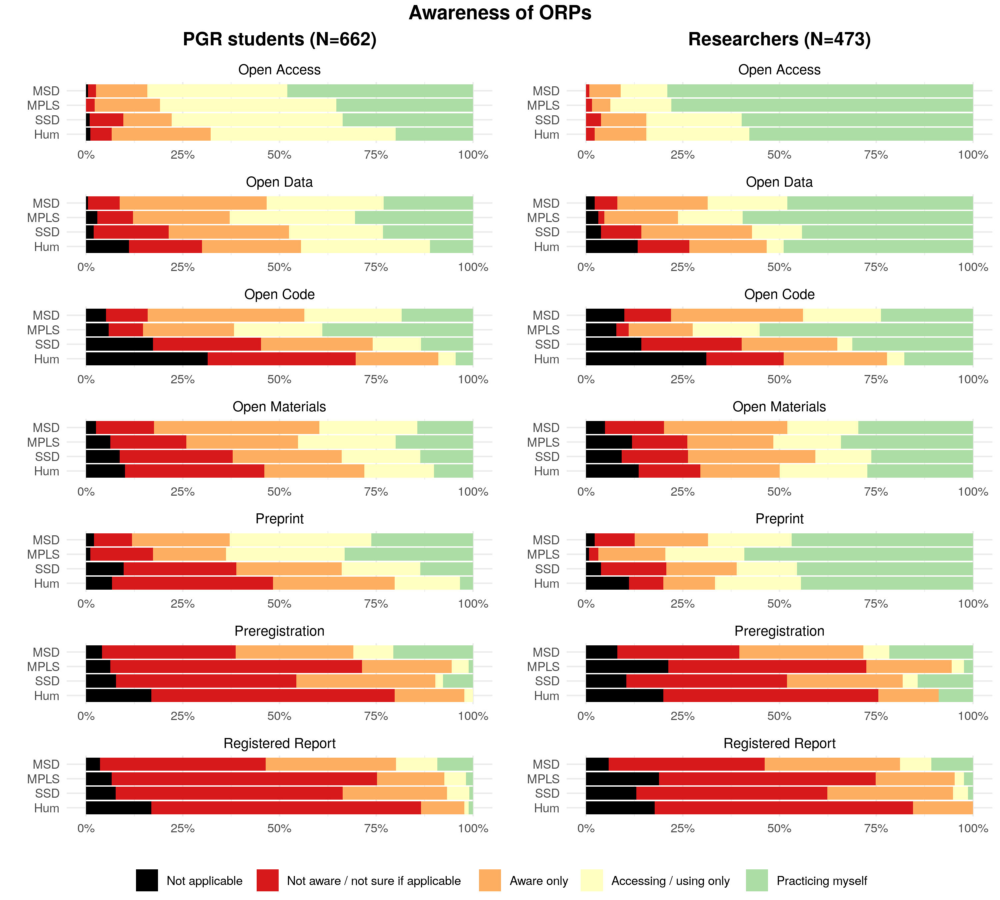

```{=html}
<style>
body {
text-align: justify}
</style>
```
```{=html}
<style type="text/css">
h1.title {
  text-align: center;
}

</style>
```
```{r setup, include=FALSE}
library(flextable)
library(tidyverse)
library(here)
library(knitr)
library(officer)
library(bookdown)

set_flextable_defaults(
  table.layout = "autofit",
  digits = 1,
  font.color = "black",
  font.family = "Calibri", 
  font.size = 10,
  line_spacing = 1 # this argument doesn't seem to work.
  )

options(dplyr.summarise.inform = FALSE) # Suppress summarise info 'summarise() has grouped output by '
```

<br>

Broadly, open research (also called 'open scholarship' or, in some disciplines, 'open science') refers to efforts to ensure that different elements of the research process are transparent and accessible.

### Open research practices

What Reproducible Research Oxford has been promoting so far are practices like Open Access publishing, Data, Code, and Material sharing, and use of Preprint, Preregistration, and Registered Reports. Definitions of relevant terms vary across fields of research and contexts, so here are the definitions we propose:

**Open Access publication** An article, book chapter, book, or other scholarly work that is released with unrestricted access (i.e. available to the public to view online, or download, without registration, payment, or approval). This includes all forms of open access, such as 'green' (i.e. the accepted version of the work, after peer review, is shared by the author(s) in a repository), and 'gold' (i.e. the version processed by the publisher is released openly on the publisher's system upon publication).

**Data** Any information underpinning a piece of research. The information can be qualitative (e.g. source, archive, representation of art, artefact) and/or quantitative (e.g. measurements, machine output, simulation results). The data can be raw (i.e. as collected), cleaned (i.e. corrected for errors), or prepared/processed (e.g. transformed into a different format for analysis, or anonymized for sharing).

**Code** Custom software developed by researchers specifically for the purpose of conducting a piece of research (e.g. a computer program to extract, clean, or analyse data, or to generate simulation results), or to build components of a research data infrastructure (e.g. a data repository).

**Materials** Any element of the research process that can be coded digitally or shared physically (e.g. protocols, survey questions, instructions, intervention materials, videos of the study procedure, specimens, reagents, samples, and other items used to collect data and/or conduct the research).

**Preprint** An article, book chapter, book, or other scholarly work that is deposited in a repository ahead of peer review. Equivalent terms used in some disciplines are 'working papers' and 'unpublished manuscripts'.

**Preregistration** The practice by which researchers specify elements of the planned work in a dedicated registry before observing the outcomes of the work. Examples include description of the planned approach for a qualitative study, and the data analysis plan for a quantitative study (i.e. a 'pre-analysis plan', which can be submitted either before the start of data collection or for previously collected datasets, before the start of data analysis).

**Registered report** A journal article format in which research question(s) and methodology are peer-reviewed before the work is conducted. A submission may be provisionally accepted for publication following peer-review, and eventually published if the authors follow through with the methodology specified in the accepted version (deviations from the registered plan are allowed, but they must be explicitly justified and noted as such). Acceptance of the article to the journal is therefore independent of the results obtained.

## Survey

We developed a survey to assess the views of Oxford researchers on those **open research practices**, related **training needs and provision**, as well as on **recruitment criteria**.

The first round was aimed at post-graduate research (PGR) students based in any Divisions of the University and was administered between 12 January 2021 and 1 March 2021. The second round was administered between 12 January 2022 and 1 March 2022 and targeted all researchers in all Divisions and Colleges, i.e.\
- **Students of post-graduate research programme** (PGR, e.g. MSc by Research; MPhil; DPhil; EPSRC CDT; NERC DTP; BBSRC DTP; DClinPsych);\
- **Research Staff or Research Fellow** (e.g. Clinical Researcher; Postdoctoral Researcher; Postdoctoral Research Assistant; Research Associate; Research Council Fellow [Senior, Advanced, Postdoctoral]; Research Fellow; Royal Society Fellow; Royal Society Research Professor; Clinical Research Fellow; Wellcome Trust Fellow);\
- **Research Support Staff** (e.g. Academic Clinical Trials Coordinator; Bioinformatician; Data Analyst; Statistician; Clinical Research Coordinator; Clinical Trials Coordinator/Officer/Manager; Knowledge Exchange Fellow/Officer; Laboratory Manager; Programme Manager; Research Analysis Officer; Research Project Manager; Research Coordinator; Research Facilitator; Science Liaison Officer; Science Officer; Theme Coordinator);\
- **Academic** (e.g. Associate Professor; Clinical Academic Staff; Clinical Lecturer; Departmental Lecturer; Professor; Reader; Head of Division).

### Sample sizes

```{r, echo = FALSE, include = FALSE}
source(here::here("Rscripts","FormatData.R"))
```

Participation in the survey was voluntary and all responses were anonymous. This means that, while the survey was advertised in all departmental newsletters (as well as other channels), people self-elected to participate; and biases in favour of people already aware of these practices and possibly favourable towards them can be expected. In addition, respondents anonymity also means that we are unable to know whether some researchers (particularly PGR students) participated in the survey in both years.

Table \@ref(tab:tabSS) shows the number of respondents per round given their role, as well as the range (minimum and maximum) of the possible unique numbers of respondents over both years (i.e. assuming all or none of the respondents participated in both years). The table also shows the census of each researcher group as extracted from the 2019 official census (with numbers unofficially revised and communicated by Divisional graduate student coordinators in 2021 for PGR students, and by the Researcher Hub in 2020 for research staff and fellows). The last column is the percentage of researchers per categories, and pooled over both years, that participated in the survey.

```{r, echo = FALSE, include = TRUE}
N %>% flextable() %>% 
    set_caption(caption = "Number of survey participants per round",
                style = "Table Caption", 
                autonum = run_autonum(seq_id = "tab", bkm = "tabSS"))
```

Given that the total number of researchers that had the opportunity to engage with the survey, and the proportion of respondents, it is unlikely that all students that responded in the second year also responded in the first year. In addition, PGR students patterns of responses in the second year looked similar as in the first year. <!--# this needs checking again and for all questions at the end of data collection. --> Therefore, the data was pooled across both years, and the cumulative sample size (max N) will be used.

Note that we have rather low coverage for research support staff so while their responses will contribute to the total results, they will not be displayed in isolation as this could be misleading, especially when the results are also split per Divisions.

Table \@ref(tab:tabSSdiv) shows the number of responses in each of the Divisions (Humanities abbreviated by '**Hum**'; Mathematical, Physical, and Life Sciences by '**MPLS**'; Medical Sciences by '**MSD**'; Social Sciences by '**SSD**'; Department for Continuing Education by '**ContEd**'; Gardens, Libraries, and Museums, by '**GLAM**'), as well as responses from **College-only staff**. College-only staff that also selected the Division their field of research is the closest too, were added to the tally from each Division.

```{r, echo = FALSE, include = TRUE}
N_div %>% flextable() %>% 
    set_caption(caption = "Number of survey participants per Division",
                style = "Table Caption", 
                autonum = run_autonum(seq_id = "tab", bkm = "tabSSdiv"))
```

We had most responses from MPLS and MSD, then somewhere between a half or a third of that in SSD and Hum, and then a few responses from GLAM, ContEd, and College-only staff that did not associate with a Division. All of the data will be used for overall results, but when showing plots with the data split per Division, only the data of the 4 main academic Divisions will be used.

All the numbers presented so far are the number of participants that answered the two mandatory questions: Role and Affiliation. As we kept respondents answers whether they completed the survey or not, this means sample size will slightly decline question after questions. Attrition rates did not depends on participants' Divisions. <!--# this needs checking again at the end of data collection. -->

```{r, echo = FALSE, include = FALSE}
sst_data
sst_data[c(1:9, 12,13),c(1,9)]
```

### Awareness of open research practices

The first question asked, after respondents' affiliation and role, was:

"**Which of the following research practices are you aware of, and which do you have experience with?** 'Aware only' indicates that the practice is applicable to your discipline, but you do not have direct experience with it. 'Accessing/using only' refers to resources made available by others. 'Practising myself' relates to implementation of the practice in your own research (in addition to, or instead of, accessing/using resources made available by others)."

```{r, echo = FALSE, include = FALSE}
source(here::here("Rscripts","Awareness.R"))
```



```{r fig-awareness, echo = FALSE, fig.width=7, fig.height=9, fig.align = "center", fig.cap = paste("Distribution of responses for awareness of ORPs across Divisions. N = ", sst_data$Total[1], sep = "")}
doubleplot_Awareness
```

On the left of Figure \@ref(fig:Awareness)

Overall, **Open Access** publishing was indicated to be the most practiced a **we recommend that the Bodleian Library's team keep raising awareness of the possibility of publishing open access following the green route (e.g. on ORA)**.

**Open Data**, **Open Code**, **Open Materials**, and **Preprint** shared relatively similar level of practice

## Overall effect of open research practices

"**In your opinion, what would be the overall effect of widespread adoption of the following practices in your field of research?**"

### Barriers to adoption of open research practices

Different factors may contribute to the adoption of open research practices, including:\
- infrastructure, i.e. tools, resources, and/or services that enable implementation of the practice (e.g. repositories for digital or physical storage; registries for preregistration; publishing platforms or outlets) and of relevant community standards (e.g. guidelines relating to citation of data and metadata; ethical and legal guidelines for sharing sensitive data);\
- training, i.e the acquisition of knowledge and/or skills needed to implement the practice;\
- norms, i.e. widespread attitudes and behaviours that support and/or encourage the practice (e.g. the perception that the field is aware of the practice and in favour of implementation; interest from early-career researchers; support from supervisors, mentors);\
- incentives, i.e. resources and/or mechanisms that reward the practice (e.g. dedicated funding, awards; institutional recognition);\
- policy, i.e. a requirement to implement the practice by relevant stakeholders (e.g. institutions, funders, publishers).

Time may be perceived as an additional factor contributing to adoption of a practice. Rather, we consider availability of time, or lack thereof, as a consequence of the factors listed above. For example, a researcher may choose to invest the time required to adopt a practice depending on:\
- the availability of infrastructure or training, which facilitate implementation;\
- the existence of norms in the community, which mitigate the burden on the researcher;\
- the presence of incentives, or policy, which reward and/or mandate the practice in the researcher's field or institution.

"**Do you face any barriers in adopting the following practices and, if so, what are they?** Tick all that apply and/or provide a brief description for any others."

`{#a %>% knitr::kable()}`

### Downsides to widespread adoption of open research practices

"**In your view, are there any downsides to widespread adoption of the following practices in your field of research?** If so, please provide a brief description."

#### what downsides

### Training needs

"**For which of the following topics do you think more guidance is necessary?** 'No guidance needed' indicates that sufficient guidance on the topic is available. 'No guidance wanted' indicates that you do not see the net benefit of engaging with the topic. Please list any additional topics in the empty boxes below."

The topics listed were:\
How to publish open access articles, theses, or monographs [labelled **Open Access**]\
How to prepare data management plans [labelled **Data Management Plan**]\
How to prepare data and metadata for archiving, and possibly for sharing in a public repository in line with community standards [labelled **Open data**]\
How to prepare ethics applications that allow archiving of anonymised data in a public repository [lablled **Ethics**]\
How to write good quality code (including unit testing, version control, reproducible documentation) and share it publicly (e.g. selection of a repository that assigns a DOI) [labelled **Open Code**]\
How to prepare materials for sharing (e.g. in a digital repository that assigns a DOI, or in a physical repository) How to choose and apply licences for sharing resources (e.g. data, materials, and/or code) and navigate relevant legislation (including copyright law, privacy and GDPR law, commercial law, and institutional regulations) [labelled **Licences**]\
How to prepare preregistrations and/or registered reports (including experimental design, statistics, data simulation) [labelled **Preregistration**]\
Guidance on sharing preprints (e.g. selection of appropriate repository, consideration of publisher's rights, ethical considerations) [labelled **Preprint**]\
How to assess job applications responsibly, fairly, and transparently [labelled ]
